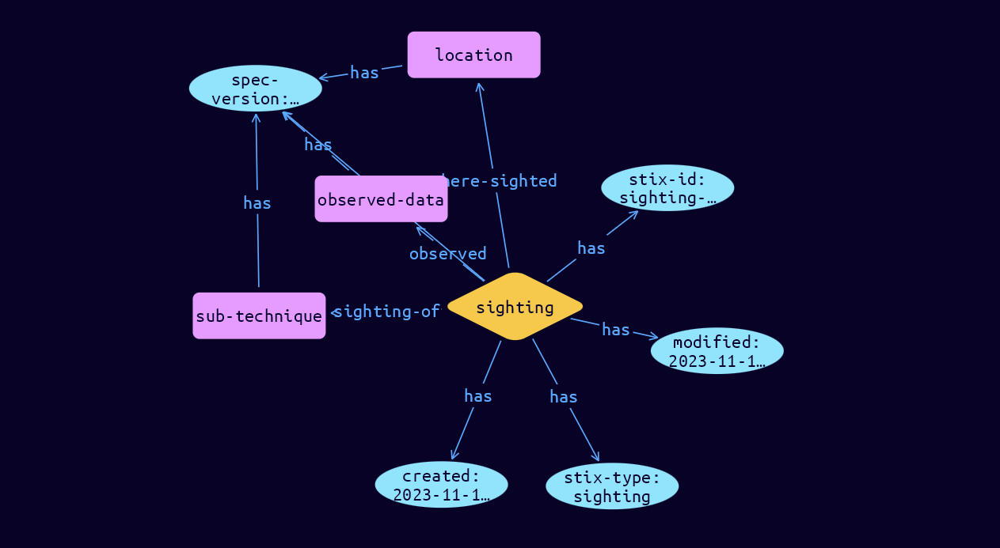

# Sighting Relationship Object

**Stix and TypeQL Object Type:**  `sighting`

A Sighting denotes the belief that something in CTI (e.g., an indicator, malware, tool, threat actor, etc.) was seen. Sightings are used to track who and what are being targeted, how attacks are carried out, and to track trends in attack behavior. Sighting is distinct from Observed Data in that Sighting is an intelligence assertion ("I saw this threat actor") while Observed Data is simply information ("I saw this file"). When you combine them by including the linked Observed Data (observed_data_refs) from a Sighting, you can say "I saw this file, and that makes me think I saw this threat actor".

 Sighting relationships relate three aspects of the sighting:

- What was sighted, such as the Indicator, Malware, Campaign, or other SDO (sighting_of_ref)
- Who sighted it and/or where it was sighted, represented as an Identity (where_sighted_refs)
- What was actually seen on systems and networks, represented as Observed Data (observed_data_refs)

In TypeDB, Sightings are represented as sub-types of stix-core-relationships, except linking 3 roles: where-sighted, sighting-of and observed.

[Reference in Stix2.1 Standard](https://docs.oasis-open.org/cti/stix/v2.1/os/stix-v2.1-os.html#_a795guqsap3r)
## Stix 2.1 Properties Converted to TypeQL
Mapping of the Stix Attack Pattern Properties to TypeDB

|  Stix 2.1 Property    |           Schema Name             | Required  Optional  |      Schema Object  Type | Schema Parent  |
|:--------------------|:--------------------------------:|:------------------:|:------------------------:|:-------------:|
|  type                 |            stix-type              |      Required       |  stix-attribute-string    |   attribute    |
|  id                   |             stix-id               |      Required       |  stix-attribute-string    |   attribute    |
|  spec_version         |           spec-version            |      Required       |  stix-attribute-string    |   attribute    |
|  created              |             created               |      Required       | stix-attribute-timestamp  |   attribute    |
|  modified             |             modified              |      Required       | stix-attribute-timestamp  |   attribute    |
|  description          |           description             |      Optional       |  stix-attribute-string    |   attribute    |
| count |count |      Optional       |  stix-attribute-integer    |   attribute    |
| sighting_of_ref  |sighting-of (role) |      Required       |   embedded     |relation |
| observed_data_refs  |observed (role) |      Optional       |   embedded     |relation |
| where_sighted_refs |where-sighted (role) |      Optional       |   embedded     |relation |
| first_seen  |start-time |      Optional       | stix-attribute-timestamp  |   attribute    |
| last_seen |stop-time |      Optional       | stix-attribute-timestamp  |   attribute    |
|  created_by_ref       |        created-by:created         |      Optional       |   embedded     |relation |
|  revoked              |             revoked               |      Optional       |  stix-attribute-boolean   |   attribute    |
|  labels               |              labels               |      Optional       |  stix-attribute-string    |   attribute    |
|  confidence           |            confidence             |      Optional       |  stix-attribute-integer   |   attribute    |
|  lang                 |               lang                |      Optional       |  stix-attribute-string    |   attribute    |
|  external_references  | external-references:referencing   |      Optional       |   embedded     |relation |
|  object_marking_refs  |      object-marking:marked        |      Optional       |   embedded     |relation |
|  granular_markings    |     granular-marking:marked       |      Optional       |   embedded     |relation |
|  extensions           |               n/a                 |        n/a          |           n/a             |      n/a       |

## The Example Sighting in JSON
The original JSON, accessible in the Python environment
```json
{
    "type": "sighting",
    "spec_version": "2.1",
    "id": "sighting--1706f5ad-1742-4503-87a1-187ac46862e9",
    "created": "2023-11-11T08:45:49.930967Z",
    "modified": "2023-11-11T08:45:49.930967Z",
    "sighting_of_ref": "attack-pattern--2b742742-28c3-4e1b-bab7-8350d6300fa7",
    "observed_data_refs": [
          "observed-data--3cb0af9e-65b5-46a8-bf93-b72b5309ee02"
    ],
    "where_sighted_refs": [
          "location--874ac72d-0810-4a6c-91e4-95982e39fdcb"
    ]
}
```


## Inserting the Example Sighting in TypeQL
The TypeQL insert statement
```typeql
match
 $attack-pattern0 isa attack-pattern, has stix-id "attack-pattern--2b742742-28c3-4e1b-bab7-8350d6300fa7";
 $observed-data0 isa observed-data, has stix-id "observed-data--3cb0af9e-65b5-46a8-bf93-b72b5309ee02";
 $location1 isa location, has stix-id "location--874ac72d-0810-4a6c-91e4-95982e39fdcb";
insert
$sighting (sighting-of:$attack-pattern0, observed:$observed-data0, where-sighted:$location1) isa sighting,
 has stix-type $stix-type,
 has spec-version $spec-version,
 has stix-id $stix-id,
 has created $created,
 has modified $modified;

 $stix-type "sighting";
 $spec-version "2.1";
 $stix-id "sighting--1706f5ad-1742-4503-87a1-187ac46862e9";
 $created 2023-11-11T08:45:49.930;
 $modified 2023-11-11T08:45:49.930;
```

## Retrieving the Example Sighting in TypeQL
The typeQL match statement

```typeql
match 
   $a (sighting-of:$b, observed:$c, where-sighted:$d) isa sighting,
      has stix-id   "sighting--1706f5ad-1742-4503-87a1-187ac46862e9",
      has $e;
```


will retrieve the example attack-pattern object in Vaticle Studio


## Retrieving the Example Sighting  in Python
The Python retrieval statement

```python
from stixorm.module.typedb import TypeDBSink, TypeDBSource
connection = {
    "uri": "localhost",
    "port": "1729",
    "database": "stix",
    "user": None,
    "password": None
}

import_type = {
    "STIX21": True,
    "CVE": False,
    "identity": False,
    "location": False,
    "rules": False,
    "ATT&CK": False,
    "ATT&CK_Versions": ["12.0"],
    "ATT&CK_Domains": ["enterprise-attack", "mobile-attack", "ics-attack"],
    "CACAO": False
}

typedb = TypeDBSource(connection, import_type)
stix_obj = typedb.get("sighting--1706f5ad-1742-4503-87a1-187ac46862e9")
```

 

[Back to OASIS Stix 2.1 Overview](../overview.md)
 

[Back to All Protocols Overview](../../overview.md)
 

[Back to Overview Doc](../../../overview.md)
