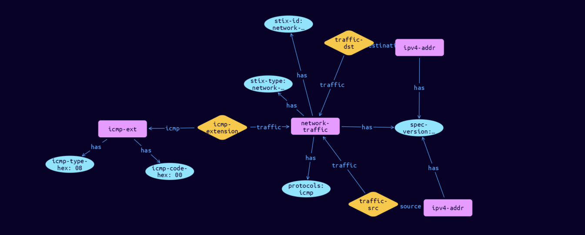

# Network-ICMP Extension Object

**Stix and TypeQL Object Type:**  `icmp-ext`

The ICMP extension specifies a default extension for capturing network traffic properties specific to ICMP. The key for this extension when used in the extensions dictionary MUST be icmp-ext. Note that this predefined extension does not use the extension facility described in section 7.3. The corresponding protocol value for this extension is icmp.

[Reference in Stix2.1 Standard](https://docs.oasis-open.org/cti/stix/v2.1/os/stix-v2.1-os.html#_ozypx0lmkebv)
## Stix 2.1 Properties Converted to TypeQL
Mapping of the Stix Attack Pattern Properties to TypeDB

|  Stix 2.1 Property    |           Schema Name             | Required  Optional  |      Schema Object Type | Schema Parent  |
|:--------------------|:--------------------------------:|:------------------:|:------------------------:|:-------------:|
| icmp_type_hex |icmp-type-hex |Required |  stix-attribute-string    |   attribute    |
| icmp_code_hex |icmp-code-hex |Required |  stix-attribute-string    |   attribute    |

## The Example Network-ICMP in JSON
The original JSON, accessible in the Python environment
```json
{      
    "type": "network-traffic",      
    "spec_version": "2.1",      
    "id": "network-traffic--e7a939ca-78c6-5f27-8ae0-4ad112454626",      
    "src_ref": "ipv4-addr--d7177770-fc12-586b-9244-426596a7008e",      
    "dst_ref": "ipv4-addr--03b708d9-7761-5523-ab75-5ea096294a68",      
    "protocols": [      
      "icmp"      
    ],      
    "extensions": {      
      "icmp-ext": {      
        "icmp_type_hex": "08",      
        "icmp_code_hex": "00"      
      }      
    }      
  }
```


## Inserting the Example Network-ICMP in TypeQL
The TypeQL insert statement
```typeql
match  
    $ipv4-addr0 isa ipv4-addr, 
        has stix-id "ipv4-addr--d7177770-fc12-586b-9244-426596a7008e";
    $ipv4-addr1 isa ipv4-addr, 
        has stix-id "ipv4-addr--03b708d9-7761-5523-ab75-5ea096294a68";
insert 
    $network-traffic isa network-traffic,
        has stix-type $stix-type,
        has spec-version $spec-version,
        has stix-id $stix-id,
        has protocols $protocols0;
    
    $stix-type "network-traffic";
    $spec-version "2.1";
    $stix-id "network-traffic--e7a939ca-78c6-5f27-8ae0-4ad112454626";
    $protocols0 "icmp";
    
    $traffic-src0 (traffic:$network-traffic, source:$ipv4-addr0) isa traffic-src;
    
    $traffic-dst1 (traffic:$network-traffic, destination:$ipv4-addr1) isa traffic-dst;
    $icmp-ext isa icmp-ext,
        has icmp-type-hex $icmp-type-hex,
        has icmp-code-hex $icmp-code-hex;
    
    $icmp-type-hex "08";
    $icmp-code-hex "00";
    
    $icmp-extension (traffic:$network-traffic, icmp:$icmp-ext) isa icmp-extension;
```

## Retrieving the Example Network-ICMP in TypeQL
The typeQL match statement

```typeql
match
    $a isa network-traffic,
        has stix-id  "network-traffic--e7a939ca-78c6-5f27-8ae0-4ad112454626",
        has $b;
    $c (owner:$a, pointed-to:$d) isa embedded;
    $e isa stix-sub-object,
        has $f;
    $g (owner:$a, pointed-to:$e) isa embedded;
```


will retrieve the example attack-pattern object in Vaticle Studio


## Retrieving the Example Network-ICMP  in Python
The Python retrieval statement

```python
from stixorm.module.typedb import TypeDBSink, TypeDBSource
connection = {
    "uri": "localhost",
    "port": "1729",
    "database": "stix",
    "user": None,
    "password": None
}

import_type = {
    "STIX21": True,
    "CVE": False,
    "identity": False,
    "location": False,
    "rules": False,
    "ATT&CK": False,
    "ATT&CK_Versions": ["12.0"],
    "ATT&CK_Domains": ["enterprise-attack", "mobile-attack", "ics-attack"],
    "CACAO": False
}

typedb = TypeDBSource(connection, import_type)
stix_obj = typedb.get("network-traffic--e7a939ca-78c6-5f27-8ae0-4ad112454626")
```

 

[Back to OASIS Stix 2.1 Overview](../overview.md)
 

[Back to All Protocols Overview](../../overview.md)
 

[Back to Overview Doc](../../../overview.md)
