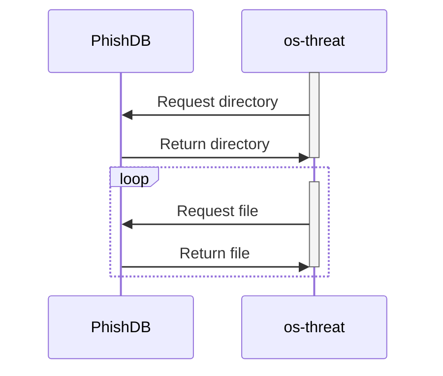
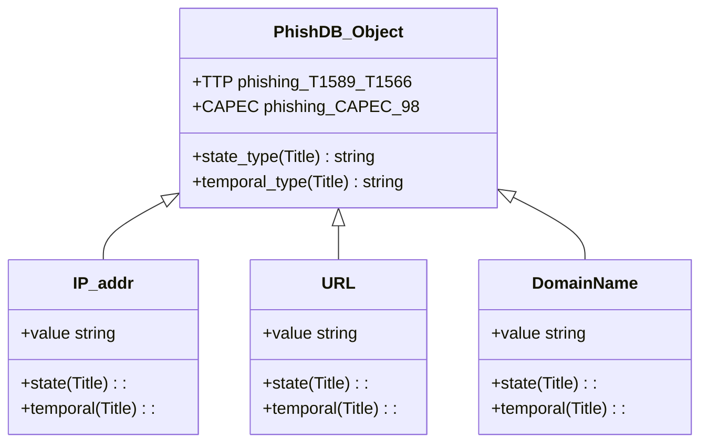
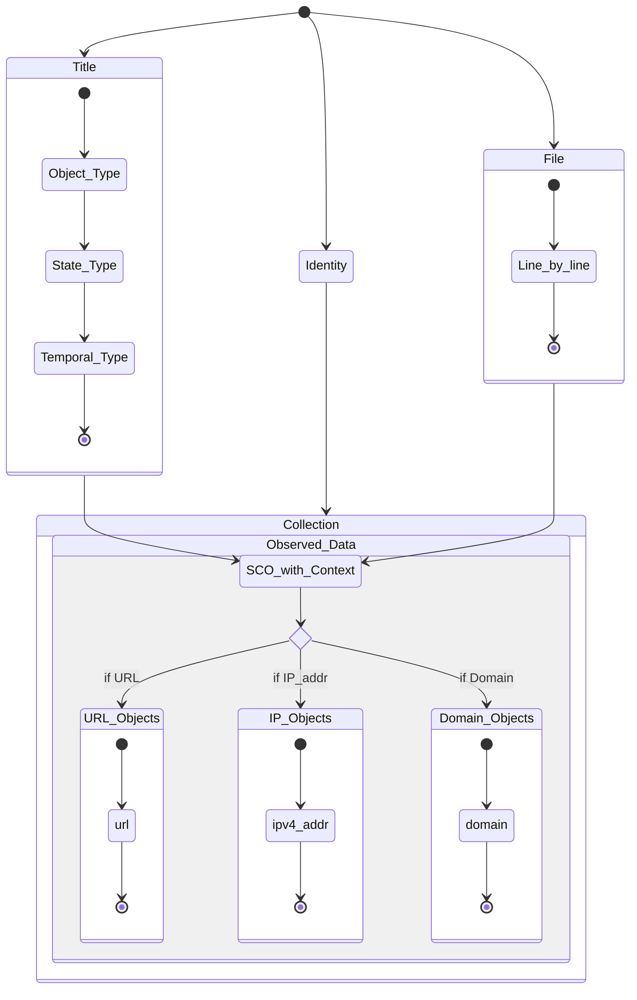

# PhishDB Feed
## 1. URL
https://github.com/mitchellkrogza/Phishing.Database

## 2.  Retrieve the Data
Retrieve all of the txt files in the root of the directory. The file label describes the file objects and context. 

Note that the tar zipped files dont encode the state and temporal context. So each text file is pulled directly where the file name encodes state and temporal context.

## 3. Returned Data Objects
For each file name (Title) PhishDB can return 3 types of values connected to the Phishing Technique:
 - ip, url, domain

Each value can have one internal state based on its HTTP response code: 
- active, inactive, invalid

Each value can be in a single temporal state:
- Last Hour, Today, Current, Discarded

The ATT&CK Tactics and Tecnhiques for Phisihng are:
- Reconnaissance Tactic:Technique [T1598](https://attack.mitre.org/techniques/T1598/)
- Initial Access Tactic: Technique [T1566](https://attack.mitre.org/techniques/T1566/)

The CAPEC Clasifiction of the Attack Pattern is:
- CAPEC: Phishing [CAPEC-98](https://capec.mitre.org/data/definitions/98.html)

The returned data looks like the diagram below.
		

## 4. Transform to Stix
The Transform Rules are:
- An Identity is assigned to the feed
- The Identity is connected to the Collection, through the `created_by` property
- The Collection holds the Observation
- The Observation holds the SCO
	- the Observation has an External Reference to the CAPEC and ATT&CK references
	- the Observation holds the state and temporal types as labels
- The SCO is formed from each line of the file

## 5. Handling Object Revoking
This type of feed does not have any explicit revoking process, and hence SCO's are revoked when they dont appear in the list any more. The complexity is that one expects the same thing with the temporal classification.

There are two possible scenarios:
1. A SCO appears in the last hour list, then in the today list, and then in the normal list
2. A SCO appears simultaneously in all lists, and is aged out of the last hour and today lists

The best way to handle this situation is to maintain a copy of all the text files from the previous pull. Thereby object revoking is handled by comparing a file from the new pull to the file from the previous pull.