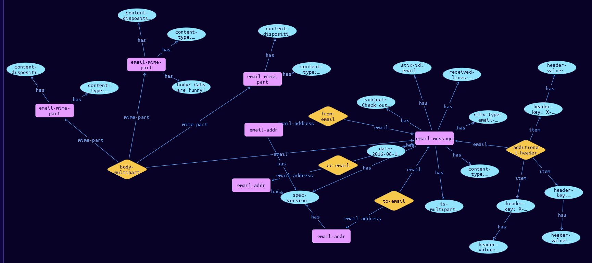

# Email-MIME-Component Cyber Obervable Object

**Stix and TypeQL Object Type:**  `email-mime-part`

Specifies one component of a multi-part email body.

There is no property to capture the value of the "Content-Transfer-Encoding" header field, since the body MUST be decoded before being represented in the body property.

One of body OR body_raw_ref MUST be included.

[Reference in Stix2.1 Standard](https://docs.oasis-open.org/cti/stix/v2.1/os/stix-v2.1-os.html#_grboc7sq5514)
## Stix 2.1 Properties Converted to TypeQL
Mapping of the Stix Attack Pattern Properties to TypeDB

|  Stix 2.1 Property    |           Schema Name             | Required  Optional  |      Schema Object Type | Schema Parent  |
|:--------------------|:--------------------------------:|:------------------:|:------------------------:|:-------------:|
| body |body |      Optional       |  stix-attribute-string    |   attribute    |
| body_raw_ref |body-raw-references:containing-mime |      Optional       |   embedded     |relation |
| content_type | content-type |      Optional       |  stix-attribute-string    |   attribute    |
| content_disposition |content-disposition |      Optional       |  stix-attribute-string    |   attribute    |

## The Example Email-MIME-Component in JSON
The original JSON, accessible in the Python environment
```json
{
  "type": "email-message",      
  "spec_version": "2.1",      
  "id": "email-message--cf9b4b7f-14c8-5955-8065-020e0316b559",      
  "is_multipart": true,      
  "received_lines": [      
    "from mail.example.com ([198.51.100.3]) by smtp.gmail.com with ESMTPSA id q23sm23309939wme.17.2016.07.19.07.20.32 (version=TLS1_2 cipher=ECDHE-RSA-AES128-GCM-SHA256 bits=128/128); Tue, 19 Jul 2016 07:20:40 -0700 (PDT)"      
  ],      
  "content_type": "multipart/mixed",      
  "date": "2016-06-19T14:20:40.000Z",      
  "from_ref": "email-addr--89f52ea8-d6ef-51e9-8fce-6a29236436ed",      
  "to_refs": ["email-addr--d1b3bf0c-f02a-51a1-8102-11aba7959868"],      
  "cc_refs": ["email-addr--e4ee5301-b52d-59cd-a8fa-8036738c7194"],      
  "subject": "Check out this picture of a cat!",      
  "additional_header_fields": {      
    "Content-Disposition": "inline",      
    "X-Mailer": "Mutt/1.5.23",      
    "X-Originating-IP": "198.51.100.3"      
  },      
  "body_multipart": [      
    {      
      "content_type": "text/plain; charset=utf-8",      
      "content_disposition": "inline",      
      "body": "Cats are funny!"      
    },      
    {      
      "content_type": "image/png",      
      "content_disposition": "attachment; filename=\"tabby.png\"",      
      "body_raw_ref": "artifact--4cce66f8-6eaa-53cb-85d5-3a85fca3a6c5"      
    },      
    {      
      "content_type": "application/zip",      
      "content_disposition": "attachment; filename=\"tabby_pics.zip\"",      
      "body_raw_ref": "file--6ce09d9c-0ad3-5ebf-900c-e3cb288955b5"      
    }      
  ]      
  } 
```


## Inserting the Example Email-MIME-Component in TypeQL
The TypeQL insert statement
```typeql
match  $email-addr0 isa email-addr, has stix-id "email-addr--89f52ea8-d6ef-51e9-8fce-6a29236436ed";
 $email-addr01 isa email-addr, has stix-id "email-addr--d1b3bf0c-f02a-51a1-8102-11aba7959868";
 $email-addr02 isa email-addr, has stix-id "email-addr--e4ee5301-b52d-59cd-a8fa-8036738c7194";
 $artifact1 isa artifact, has stix-id "artifact--4cce66f8-6eaa-53cb-85d5-3a85fca3a6c5";
 $file2 isa file, has stix-id "file--6ce09d9c-0ad3-5ebf-900c-e3cb288955b5";
insert $email-message isa email-message,
 has stix-type $stix-type,
 has spec-version $spec-version,
 has stix-id $stix-id,
 has is-multipart $is-multipart,
 has date $date,
 has content-type $content-type,
 has subject $subject,
 has received-lines $received_lines0;

 $stix-type "email-message";
 $spec-version "2.1";
 $stix-id "email-message--cf9b4b7f-14c8-5955-8065-020e0316b559";
 $is-multipart true;
 $date 2016-06-19T14:20:40.000;
 $content-type "multipart/mixed";
 $subject "Check out this picture of a cat!";
 $received_lines0 "from mail.example.com ([198.51.100.3]) by smtp.gmail.com with ESMTPSA id q23sm23309939wme.17.2016.07.19.07.20.32 (version=TLS1_2 cipher=ECDHE-RSA-AES128-GCM-SHA256 bits=128/128); Tue, 19 Jul 2016 07:20:40 -0700 (PDT)";


 $from-email0 (email:$email-message, email-address:$email-addr0) isa from-email;

 $to-email1 (email:$email-message, email-address:$email-addr01) isa to-email;

 $cc-email2 (email:$email-message, email-address:$email-addr02) isa cc-email;

 $header-key0 isa header-key;  $header-key0 "Content-Disposition";
 $header-key0 has header-value "inline";
 $header-key1 isa header-key;  $header-key1 "X-Mailer";
 $header-key1 has header-value "Mutt/1.5.23";
 $header-key2 isa header-key;  $header-key2 "X-Originating-IP";
 $header-key2 has header-value "198.51.100.3";
 $additional-header (email:$email-message, item: $header-key0, item: $header-key1, item: $header-key2) isa additional-header;

$email-mime-part0 isa email-mime-part,
 has body "Cats are funny!",
 has content-type "text/plain; charset=utf-8",
 has content-disposition "inline";
$email-mime-part1 isa email-mime-part,
 has content-type "image/png",
 has content-disposition "attachment; filename='tabby.png'";
$email-mime-part2 isa email-mime-part,
 has content-type "application/zip",
 has content-disposition "attachment; filename='tabby_pics.zip'";

 $body-multipart (email:$email-message, mime-part:$email-mime-part0, mime-part:$email-mime-part1, mime-part:$email-mime-part2) isa body-multipart;

 $body-raw-references1 (containing-mime:$email-mime-part1, non-textual:$artifact1) isa body-raw-references;

 $body-raw-references2 (containing-mime:$email-mime-part2, non-textual:$file2) isa body-raw-references;
```

## Retrieving the Example Email-MIME-Component in TypeQL
The typeQL match statement

```typeql
match
    $a isa email-message,
        has stix-id "email-message--cf9b4b7f-14c8-5955-8065-020e0316b559",
        has $b;
    $c (owner:$a, pointed-to:$d) isa embedded;
    $e isa header-key, has $f;
    $g (owner:$a, pointed-to:$e) isa embedded;
    $h isa stix-sub-object,
        has $i;
    $j (owner:$a, pointed-to:$h) isa embedded;
```


will retrieve the example attack-pattern object in Vaticle Studio


## Retrieving the Example Email-MIME-Component  in Python
The Python retrieval statement

```python
from stix.module.typedb_lib import TypeDBSink, TypeDBSource

connection = {
    "uri": "localhost",
    "port": "1729",
    "database": "stix",
    "user": None,
    "password": None
}

import_type = {
    "STIX21": True,
    "CVE": False,
    "identity": False,
    "location": False,
    "rules": False,
    "ATT&CK": False,
    "ATT&CK_Versions": ["12.0"],
    "ATT&CK_Domains": ["enterprise-attack", "mobile-attack", "ics-attack"],
    "CACAO": False
}

typedb = TypeDBSource(connection, import_type)
stix_obj = typedb.get("email-message--cf9b4b7f-14c8-5955-8065-020e0316b559")
```

