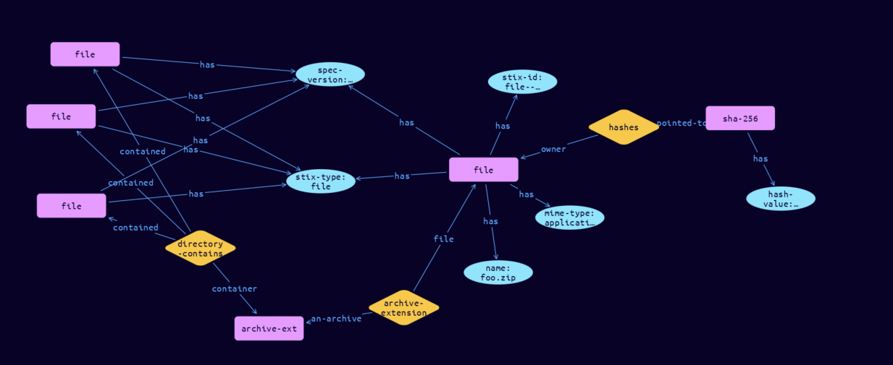

# File-Archive Cyber Obervable Object

**Stix and TypeQL Object Type:**  `archive-ext`

The Archive File extension specifies a default extension for capturing properties specific to archive files. The key for this extension when used in the extensions dictionary MUST be archive-ext. Note that this predefined extension does not use the extension facility described in section 7.3.

[Reference in Stix2.1 Standard](https://docs.oasis-open.org/cti/stix/v2.1/os/stix-v2.1-os.html#_xi3g7dwaigs6)
## Stix 2.1 Properties Converted to TypeQL
Mapping of the Stix Attack Pattern Properties to TypeDB

|  Stix 2.1 Property    |           Schema Name             | Required  Optional  |      Schema Object Type | Schema Parent  |
|:--------------------|:--------------------------------:|:------------------:|:------------------------:|:-------------:|
| contains_refs |directory-contains:container |      Required       |   embedded     |relation |
| comment |comment |      Optional       |  stix-attribute-string    |   attribute    |

## The Example File-Archive in JSON
The original JSON, accessible in the Python environment
```json
{      
    "type": "file",      
    "spec_version": "2.1",      
    "id": "file--9a1f834d-2506-5367-baec-7aa63996ac43",      
    "name": "foo.zip",      
    "hashes": {      
      "SHA-256": "35a01331e9ad96f751278b891b6ea09699806faedfa237d40513d92ad1b7100f"      
    },      
    "mime_type": "application/zip",      
    "extensions": {      
      "archive-ext": {      
        "contains_refs": [      
          "file--019fde1c-94ca-5967-8b3c-a906a51d87ac",      
          "file--94fc2163-dec3-5715-b824-6e689c4de865",      
          "file--d07ff290-d7e0-545b-a2ff-04602a9e0b73"      
        ]      
      }      
    }      
  }
```


## Inserting the Example File-Archive in TypeQL
The TypeQL insert statement
```typeql
match  
    $file0 isa file, 
        has stix-id "file--019fde1c-94ca-5967-8b3c-a906a51d87ac";
    $file1 isa file, 
        has stix-id "file--94fc2163-dec3-5715-b824-6e689c4de865";
    $file2 isa file, 
        has stix-id "file--d07ff290-d7e0-545b-a2ff-04602a9e0b73";
insert 
    $file isa file,
        has stix-type $stix-type,
        has spec-version $spec-version,
        has stix-id $stix-id,
        has name $name,
        has mime-type $mime-type;
    
    $stix-type "file";
    $spec-version "2.1";
    $stix-id "file--9a1f834d-2506-5367-baec-7aa63996ac43";
    $name "foo.zip";
    $mime-type "application/zip";
    
    $hash0 isa sha-256, has hash-value "35a01331e9ad96f751278b891b6ea09699806faedfa237d40513d92ad1b7100f";    
    $hash_rel (owner:$file, pointed-to:$hash0) isa hashes;
    
    $archive-ext isa archive-ext;    
    $archive-extension (file:$file, an-archive:$archive-ext) isa archive-extension;    
    $directory-contains (container:$archive-ext, contained:$file0, contained:$file1, contained:$file2) isa directory-contains;
```

## Retrieving the Example File-Archive in TypeQL
The typeQL match statement

```typeql
match
    $a isa file,
        has stix-id "file--9a1f834d-2506-5367-baec-7aa63996ac43",
        has $b;
    $c isa stix-sub-object,
        has $d;
    $e (owner:$a, pointed-to:$c) isa embedded;
    $g (owner:$a, pointed-to:$h) isa embedded;
    $i (owner:$h, pointed-to:$j) isa embedded;
```


will retrieve the example attack-pattern object in Vaticle Studio


## Retrieving the Example File-Archive  in Python
The Python retrieval statement

```python
from stix.module.typedb_lib import TypeDBSink, TypeDBSource

connection = {
    "uri": "localhost",
    "port": "1729",
    "database": "stix",
    "user": None,
    "password": None
}

import_type = {
    "STIX21": True,
    "CVE": False,
    "identity": False,
    "location": False,
    "rules": False,
    "ATT&CK": False,
    "ATT&CK_Versions": ["12.0"],
    "ATT&CK_Domains": ["enterprise-attack", "mobile-attack", "ics-attack"],
    "CACAO": False
}

typedb = TypeDBSource(connection, import_type)
stix_obj = typedb.get("file--9a1f834d-2506-5367-baec-7aa63996ac43")
```

