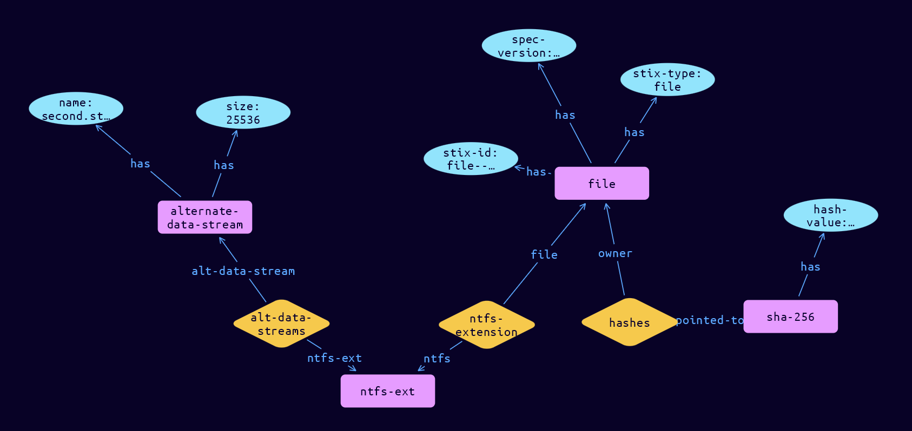

# File-NTFS Cyber Obervable Object

**Stix and TypeQL Object Type:**  `ntfs-ext`

The NTFS file extension specifies a default extension for capturing properties specific to the storage of the file on the NTFS file system. The key for this extension when used in the extensions dictionary MUST be ntfs-ext. Note that this predefined extension does not use the extension facility described in section 7.3.

An object using the NTFS File Extension MUST contain at least one property from this extension.

[Reference in Stix2.1 Standard](https://docs.oasis-open.org/cti/stix/v2.1/os/stix-v2.1-os.html#_o6cweepfrsci)
## Stix 2.1 Properties Converted to TypeQL
Mapping of the Stix Attack Pattern Properties to TypeDB

|  Stix 2.1 Property    |           Schema Name             | Required  Optional  |      Schema Object Type | Schema Parent  |
|:--------------------|:--------------------------------:|:------------------:|:------------------------:|:-------------:|
| sid |sid |      Optional       |  stix-attribute-string    |   attribute    |
| alternate_data_streams |alt-data-streams:ntfs-ext |      Optional       |   embedded     |relation |

## The Example File-NTFS in JSON
The original JSON, accessible in the Python environment
```json

    "type": "file",  
    "spec_version": "2.1",  
    "id": "file--73c4cd13-7206-5100-88ef-822c42d3f02c",  
    "hashes": {  
      "SHA-256": "35a01331e9ad96f751278b891b6ea09699806faedfa237d40513d92ad1b7100f"  
    },  
    "extensions": {  
      "ntfs-ext": {  
        "alternate_data_streams": [  
          {  
            "name": "second.stream",  
            "size": 25536  
          }  
        ]  
      }  
    }  
  }
```


## Inserting the Example File-NTFS in TypeQL
The TypeQL insert statement
```typeql
insert 
    $file isa file,
        has stix-type $stix-type,
        has spec-version $spec-version,
        has stix-id $stix-id;
    
    $stix-type "file";
    $spec-version "2.1";
    $stix-id "file--73c4cd13-7206-5100-88ef-822c42d3f02c";
    
    $hash0 isa sha-256, has hash-value "35a01331e9ad96f751278b891b6ea09699806faedfa237d40513d92ad1b7100f";
    
    $hash_rel (owner:$file, pointed-to:$hash0) isa hashes;
    $ntfs-ext isa ntfs-ext;
    
    $ntfs-extension (file:$file, ntfs:$ntfs-ext) isa ntfs-extension;
    
    $alternate-data-stream0 isa alternate-data-stream,
        has name "second.stream",
        has size 25536;
    
    $alt-data-streams (ntfs-ext:$ntfs-ext, alt-data-stream:$alternate-data-stream0) isa alt-data-streams;
```

## Retrieving the Example File-NTFS in TypeQL
The typeQL match statement

```typeql
match
    $a isa file,
        has stix-id "file--73c4cd13-7206-5100-88ef-822c42d3f02c",
        has $b;
    $c isa stix-sub-object,
        has $d;
    $e (owner:$a, pointed-to:$c) isa embedded;
    $g (owner:$a, pointed-to:$h) isa embedded;
    $i isa stix-sub-object,
        has $j;
    $k (owner:$h, pointed-to:$i) isa embedded;
```


will retrieve the example attack-pattern object in Vaticle Studio


## Retrieving the Example File-NTFS  in Python
The Python retrieval statement

```python
from stix.module.typedb_lib import TypeDBSink, TypeDBSource

connection = {
    "uri": "localhost",
    "port": "1729",
    "database": "stix",
    "user": None,
    "password": None
}

import_type = {
    "STIX21": True,
    "CVE": False,
    "identity": False,
    "location": False,
    "rules": False,
    "ATT&CK": False,
    "ATT&CK_Versions": ["12.0"],
    "ATT&CK_Domains": ["enterprise-attack", "mobile-attack", "ics-attack"],
    "CACAO": False
}

typedb = TypeDBSource(connection, import_type)
stix_obj = typedb.get("file--73c4cd13-7206-5100-88ef-822c42d3f02c")
```

