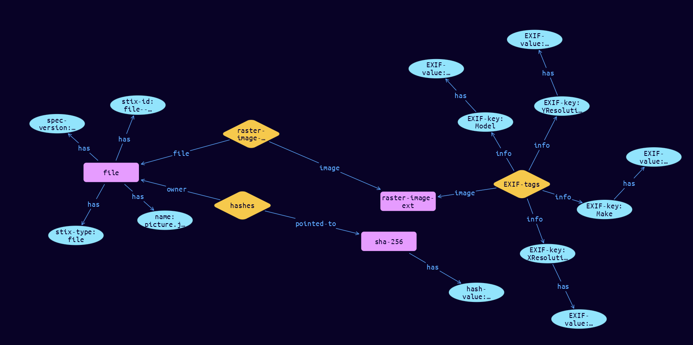

# File-Raster-Image Cyber Obervable Object

**Stix and TypeQL Object Type:**  `raster-image-ext`

The Raster Image file extension specifies a default extension for capturing properties specific to raster image files. The key for this extension when used in the extensions dictionary MUST be raster-image-ext. Note that this predefined extension does not use the extension facility described in section 7.3.

An object using the Raster Image File Extension MUST contain at least one property from this extension.

[Reference in Stix2.1 Standard](https://docs.oasis-open.org/cti/stix/v2.1/os/stix-v2.1-os.html#_u5z7i2ox8w4x)
## Stix 2.1 Properties Converted to TypeQL
Mapping of the Stix Attack Pattern Properties to TypeDB

|  Stix 2.1 Property    |           Schema Name             | Required  Optional  |      Schema Object Type | Schema Parent  |
|:--------------------|:--------------------------------:|:------------------:|:------------------------:|:-------------:|
| image_height |image-height |      Optional       |  stix-attribute-string    |   attribute    |
| image_width |image-width |      Optional       |  stix-attribute-boolean    |   attribute    |
| bits_per_pixel |bits-per-pixel |      Optional       |  stix-attribute-string    |   attribute    |
| exif_tags |EXIF-tags:image |      Optional       |   embedded     |relation |

## The Example File-Raster-Image in JSON
The original JSON, accessible in the Python environment
```json
{
    "type": "file",  
    "spec_version": "2.1",  
    "id": "file--c7d1e135-8b34-549a-bb47-302f5cf998ed",  
    "name": "picture.jpg",  
    "hashes": {  
      "SHA-256": "4bac27393bdd9777ce02453256c5577cd02275510b2227f473d03f533924f877"  
    },  
    "extensions": {  
      "raster-image-ext": {  
        "exif_tags": {  
          "Make": "Nikon",  
          "Model": "D7000",  
          "XResolution": 4928,  
          "YResolution": 3264  
        }  
      }  
    }  
  }
```


## Inserting the Example File-Raster-Image in TypeQL
The TypeQL insert statement
```typeql
insert 
    $file isa file,
        has stix-type $stix-type,
        has spec-version $spec-version,
        has stix-id $stix-id,
        has name $name;
    
    $stix-type "file";
    $spec-version "2.1";
    $stix-id "file--c7d1e135-8b34-549a-bb47-302f5cf998ed";
    $name "picture.jpg";
    
    $hash0 isa sha-256, has hash-value "4bac27393bdd9777ce02453256c5577cd02275510b2227f473d03f533924f877";
    $hash_rel (owner:$file, pointed-to:$hash0) isa hashes;
    
    $raster-image-ext isa raster-image-ext;
    $raster-image-extension (file:$file, image:$raster-image-ext) isa raster-image-extension;
    
    $EXIF-key0 isa EXIF-key;  $EXIF-key0 "Make";
    $EXIF-key0 has EXIF-value "Nikon";
    $EXIF-key1 isa EXIF-key;  $EXIF-key1 "Model";
    $EXIF-key1 has EXIF-value "D7000";
    $EXIF-key2 isa EXIF-key;  $EXIF-key2 "XResolution";
    $EXIF-key2 has EXIF-value "4928";
    $EXIF-key3 isa EXIF-key;  $EXIF-key3 "YResolution";
    $EXIF-key3 has EXIF-value "3264";
    $EXIF-tags (image:$raster-image-ext, info: $EXIF-key0, info: $EXIF-key1, info: $EXIF-key2, info: $EXIF-key3) isa EXIF-tags;
```

## Retrieving the Example File-Raster-Image in TypeQL
The typeQL match statement

```typeql
match
    $a isa file,
        has stix-id "file--c7d1e135-8b34-549a-bb47-302f5cf998ed",
        has $b;
    $c isa stix-sub-object,
        has $d;
    $e (owner:$a, pointed-to:$c) isa embedded;
    $g (owner:$a, pointed-to:$f) isa embedded;
    $h has $j;
    $i (owner:$f, pointed-to:$h) isa embedded;
```


will retrieve the example attack-pattern object in Vaticle Studio


## Retrieving the Example File-Raster-Image  in Python
The Python retrieval statement

```python
from stix.module.typedb_lib import TypeDBSink, TypeDBSource

connection = {
    "uri": "localhost",
    "port": "1729",
    "database": "stix",
    "user": None,
    "password": None
}

import_type = {
    "STIX21": True,
    "CVE": False,
    "identity": False,
    "location": False,
    "rules": False,
    "ATT&CK": False,
    "ATT&CK_Versions": ["12.0"],
    "ATT&CK_Domains": ["enterprise-attack", "mobile-attack", "ics-attack"],
    "CACAO": False
}

typedb = TypeDBSource(connection, import_type)
stix_obj = typedb.get("file--c7d1e135-8b34-549a-bb47-302f5cf998ed")
```

