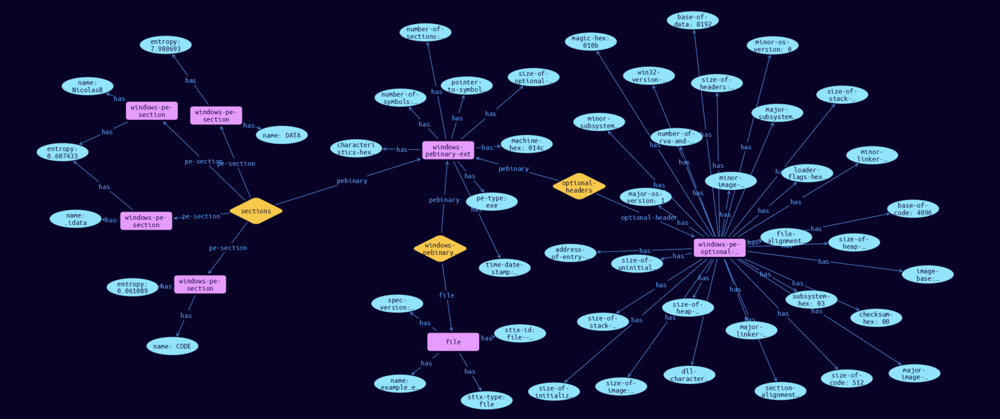

# File-Windows-PE-Binary Cyber Obervable Object

**Stix and TypeQL Object Type:**  `windows-pebinary-ext`

The Windows™ PE Binary File extension specifies a default extension for capturing properties specific to Windows portable executable (PE) files. The key for this extension when used in the extensions dictionary MUST be windows-pebinary-ext. Note that this predefined extension does not use the extension facility described in section 7.3.

An object using the Windows™ PE Binary File Extension MUST contain at least one property other than the required pe_type property from this extension.

Note that the example below also contains data and properties from the "windows-pe-optional-header-type" and the "windows-pe-section-type" 

[Reference in Stix2.1 Standard](https://docs.oasis-open.org/cti/stix/v2.1/os/stix-v2.1-os.html#_gg5zibddf9bs)
## Stix 2.1 Properties Converted to TypeQL
Mapping of the Stix Attack Pattern Properties to TypeDB

|  Stix 2.1 Property    |           Schema Name             | Required  Optional  |      Schema Object Type | Schema Parent  |
|:--------------------|:--------------------------------:|:------------------:|:------------------------:|:-------------:|
| pe_type  |pe-type, |Required |  stix-attribute-string    |   attribute    |
| imphash  |imphash, |      Optional       |  stix-attribute-string    |   attribute    |
| machine_hex  |machine-hex, |      Optional       |  stix-attribute-string    |   attribute    |
| number_of_sections  |number-of-sections, |      Optional       |  stix-attribute-integer    |   attribute    |
| time_date_stamp  |time-date-stamp, |      Optional       |  stix-attribute-timestamp    |   attribute    |
| pointer_to_symbol_table_hex  |pointer-to-symbol-table-hex, |      Optional       |  stix-attribute-string    |   attribute    |
| number_of_symbols  |number-of-symbols, |      Optional       |  stix-attribute-integer    |   attribute    |
| size_of_optional_header  |size-of-optional-header, |      Optional       |  stix-attribute-integer    |   attribute    |
| characteristics_hex  |characteristics-hex, |      Optional       |  stix-attribute-string    |   attribute    |
| file_header_hashes  |hashes:owner, |      Optional       |embedded |relation |
| optional_header  |optional-headers:pebinary, |      Optional       |embedded |relation |
| sections  |sections:pebinary, |      Optional       |embedded |relation |

## The Example File-Windows-PE-Binary in JSON
The original JSON, accessible in the Python environment
```json
{
    "type": "file",  
    "spec_version": "2.1",  
    "id": "file--fb0419a8-f09c-57f8-be64-71a80417591c",  
    "name": "example.exe",  
    "extensions": {  
      "windows-pebinary-ext": {  
        "pe_type": "exe",  
        "machine_hex": "014c",  
        "number_of_sections": 4,  
        "time_date_stamp": "2016-01-22T12:31:12Z",  
        "pointer_to_symbol_table_hex": "74726144",  
        "number_of_symbols": 4542568,  
        "size_of_optional_header": 224,  
        "characteristics_hex": "818f",  
        "optional_header": {  
          "magic_hex": "010b",  
          "major_linker_version": 2,  
          "minor_linker_version": 25,  
          "size_of_code": 512,  
          "size_of_initialized_data": 283648,  
          "size_of_uninitialized_data": 0,  
          "address_of_entry_point": 4096,  
          "base_of_code": 4096,  
          "base_of_data": 8192,  
          "image_base": 14548992,  
          "section_alignment": 4096,  
          "file_alignment": 4096,  
          "major_os_version": 1,  
          "minor_os_version": 0,  
          "major_image_version": 0,  
          "minor_image_version": 0,  
          "major_subsystem_version": 4,  
          "minor_subsystem_version": 0,  
          "win32_version_value_hex": "00",  
          "size_of_image": 299008,  
          "size_of_headers": 4096,  
          "checksum_hex": "00",  
          "subsystem_hex": "03",  
          "dll_characteristics_hex": "00",  
          "size_of_stack_reserve": 100000,  
          "size_of_stack_commit": 8192,  
          "size_of_heap_reserve": 100000,  
          "size_of_heap_commit": 4096,  
          "loader_flags_hex": "abdbffde",  
          "number_of_rva_and_sizes": 3758087646  
        },  
        "sections": [  
          {  
            "name": "CODE",  
            "entropy": 0.061089  
          },  
          {  
            "name": "DATA",  
            "entropy": 7.980693  
          },  
          {  
            "name": "NicolasB",  
            "entropy": 0.607433  
          },  
          {  
            "name": ".idata",  
            "entropy": 0.607433  
          }  
        ]  
      }  
    }  
  }
```


## Inserting the Example File-Windows-PE-Binary in TypeQL
The TypeQL insert statement
```typeql
insert 
    $file isa file,
        has stix-type $stix-type,
        has spec-version $spec-version,
        has stix-id $stix-id,
        has name $name;
    
    $stix-type "file";
    $spec-version "2.1";
    $stix-id "file--fb0419a8-f09c-57f8-be64-71a80417591c";
    $name "example.exe";
    
    $windows-pebinary-ext isa windows-pebinary-ext,
        has pe-type $pe-type,
        has machine-hex $machine-hex,
        has number-of-sections $number-of-sections,
        has time-date-stamp $time-date-stamp,
        has pointer-to-symbol-table-hex $pointer-to-symbol-table-hex,
        has number-of-symbols $number-of-symbols,
        has size-of-optional-header $size-of-optional-header,
        has characteristics-hex $characteristics-hex;
    
    $pe-type "exe";
    $machine-hex "014c";
    $number-of-sections 4;
    $time-date-stamp 2016-01-22T12:31:12.000;
    $pointer-to-symbol-table-hex "74726144";
    $number-of-symbols 4542568;
    $size-of-optional-header 224;
    $characteristics-hex "818f";
    
    $windows-pebinary-extension (file:$file, pebinary:$windows-pebinary-ext) isa windows-pebinary-extension;
    
    $windows-pe-optional-header-type isa windows-pe-optional-header-type,
        has magic-hex $magic-hex,
        has major-linker-version $major-linker-version,
        has minor-linker-version $minor-linker-version,
        has size-of-code $size-of-code,
        has size-of-initialized-data $size-of-initialized-data,
        has size-of-uninitialized-data $size-of-uninitialized-data,
        has address-of-entry-point $address-of-entry-point,
        has base-of-code $base-of-code,
        has base-of-data $base-of-data,
        has image-base $image-base,
        has section-alignment $section-alignment,
        has file-alignment $file-alignment,
        has major-os-version $major-os-version,
        has minor-os-version $minor-os-version,
        has major-image-version $major-image-version,
        has minor-image-version $minor-image-version,
        has major-subsystem-version $major-subsystem-version,
        has minor-subsystem-version $minor-subsystem-version,
        has win32-version-value-hex $win32-version-value-hex,
        has size-of-image $size-of-image,
        has size-of-headers $size-of-headers,
        has checksum-hex $checksum-hex,
        has subsystem-hex $subsystem-hex,
        has dll-characteristics-hex $dll-characteristics-hex,
        has size-of-stack-reserve $size-of-stack-reserve,
        has size-of-stack-commit $size-of-stack-commit,
        has size-of-heap-reserve $size-of-heap-reserve,
        has size-of-heap-commit $size-of-heap-commit,
        has loader-flags-hex $loader-flags-hex,
        has number-of-rva-and-sizes $number-of-rva-and-sizes;
    
    $magic-hex "010b";
    $major-linker-version 2;
    $minor-linker-version 25;
    $size-of-code 512;
    $size-of-initialized-data 283648;
    $size-of-uninitialized-data 0;
    $address-of-entry-point 4096;
    $base-of-code 4096;
    $base-of-data 8192;
    $image-base 14548992;
    $section-alignment 4096;
    $file-alignment 4096;
    $major-os-version 1;
    $minor-os-version 0;
    $major-image-version 0;
    $minor-image-version 0;
    $major-subsystem-version 4;
    $minor-subsystem-version 0;
    $win32-version-value-hex "00";
    $size-of-image 299008;
    $size-of-headers 4096;
    $checksum-hex "00";
    $subsystem-hex "03";
    $dll-characteristics-hex "00";
    $size-of-stack-reserve 100000;
    $size-of-stack-commit 8192;
    $size-of-heap-reserve 100000;
    $size-of-heap-commit 4096;
    $loader-flags-hex "abdbffde";
    $number-of-rva-and-sizes 3758087646;
    
    $optional-headers (pebinary:$windows-pebinary-ext, optional-header:$windows-pe-optional-header-type) isa optional-headers;
    
    $windows-pe-section0 isa windows-pe-section,
        has name "CODE",
        has entropy 0.061089;
    $windows-pe-section1 isa windows-pe-section,
        has name "DATA",
        has entropy 7.980693;
    $windows-pe-section2 isa windows-pe-section,
        has name "NicolasB",
        has entropy 0.607433;
    $windows-pe-section3 isa windows-pe-section,
        has name ".idata",
        has entropy 0.607433;
    
    $sections (pebinary:$windows-pebinary-ext, pe-section:$windows-pe-section0, pe-section:$windows-pe-section1, pe-section:$windows-pe-section2, pe-section:$windows-pe-section3) isa sections;
```

## Retrieving the Example File-Windows-PE-Binary in TypeQL
The typeQL match statement

```typeql
match
    $a isa file,
        has stix-id "file--fb0419a8-f09c-57f8-be64-71a80417591c",
        has $b;
    $c isa stix-sub-object,
        has $d;
    $e (owner:$a, pointed-to:$c) isa embedded;
    $g (owner:$a, pointed-to:$f) isa embedded;
    $h has $j;
    $i (owner:$f, pointed-to:$h) isa embedded;
```


will retrieve the example attack-pattern object in Vaticle Studio


## Retrieving the Example File-Windows-PE-Binary  in Python
The Python retrieval statement

```python
from stix.module.typedb import TypeDBSink, TypeDBSource
connection = {
    "uri": "localhost",
    "port": "1729",
    "database": "stix",
    "user": None,
    "password": None
}

import_type = {
    "STIX21": True,
    "CVE": False,
    "identity": False,
    "location": False,
    "rules": False,
    "ATT&CK": False,
    "ATT&CK_Versions": ["12.0"],
    "ATT&CK_Domains": ["enterprise-attack", "mobile-attack", "ics-attack"],
    "CACAO": False
}

typedb = TypeDBSource(connection, import_type)
stix_obj = typedb.get("file--fb0419a8-f09c-57f8-be64-71a80417591c",)
```

