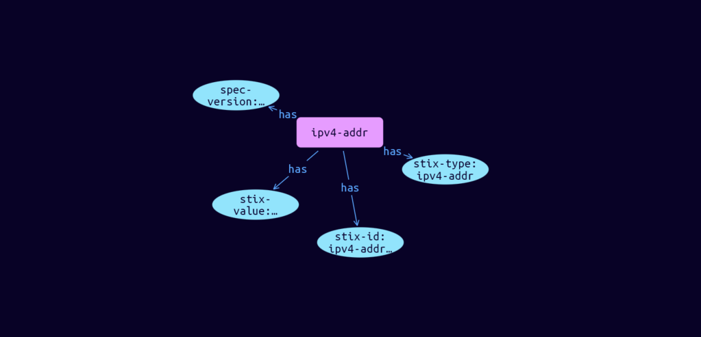

# IPv4-Address Cyber Obervable Object

**Stix and TypeQL Object Type:**  `ipv4-addr`

The IPv4 Address object represents one or more IPv4 addresses expressed using CIDR notation.

[Reference in Stix2.1 Standard](https://docs.oasis-open.org/cti/stix/v2.1/os/stix-v2.1-os.html#_ki1ufj1ku8s0)
## Stix 2.1 Properties Converted to TypeQL
Mapping of the Stix Attack Pattern Properties to TypeDB

|  Stix 2.1 Property    |           Schema Name             | Required  Optional  |      Schema Object Type | Schema Parent  |
|:--------------------|:--------------------------------:|:------------------:|:------------------------:|:-------------:|
|  type                 |            stix-type              |      Required       |  stix-attribute-string    |   attribute    |
|  id                   |             stix-id               |      Required       |  stix-attribute-string    |   attribute    |
|  spec_version         |           spec-version            |      Optional       |  stix-attribute-string    |   attribute    |
|  object_marking_refs  |      object-marking:marked        |      Optional       |   embedded     |relation |
|  granular_markings    |     granular-marking:marked       |      Optional       |   embedded     |relation |
| defanged |defanged |      Optional       |stix-attribute-boolean |   attribute    |
|  extensions           |               n/a                 |        n/a          |           n/a             |      n/a       |
| value |stix-value |      Optional       |  stix-attribute-string    |   attribute    |
| resolves_to_refs |resolves-to-ref:from-ref |      Optional       |   embedded     |relation |
| belongs_to_refs |belongs-to-autonomous:belonged |      Optional       |   embedded     |relation |

## The Example IPv4-Address in JSON
The original JSON, accessible in the Python environment
```json
{
    "type": "ipv4-addr",  
    "spec_version": "2.1",  
    "id": "ipv4-addr--ff26c055-6336-5bc5-b89d-13d6226742dd",
    "value": "198.51.100.3"  
  }
```


## Inserting the Example IPv4-Address in TypeQL
The TypeQL insert statement
```typeql
insert 
    $ipv4-addr isa ipv4-addr,
        has stix-type $stix-type,
        has spec-version $spec-version,
        has stix-id $stix-id,
        has stix-value $stix-value;
    
    $stix-type "ipv4-addr";
    $spec-version "2.1";
    $stix-id "ipv4-addr--ff26c055-6336-5bc5-b89d-13d6226742dd";
    $stix-value "198.51.100.3";
```

## Retrieving the Example IPv4-Address in TypeQL
The typeQL match statement

```typeql
match
    $a isa ipv4-addr,
        has stix-id "ipv4-addr--ff26c055-6336-5bc5-b89d-13d6226742dd",
        has $b;
```


will retrieve the example attack-pattern object in Vaticle Studio


## Retrieving the Example IPv4-Address  in Python
The Python retrieval statement

```python
from stix.module.typedb_lib import TypeDBSink, TypeDBSource

connection = {
    "uri": "localhost",
    "port": "1729",
    "database": "stix",
    "user": None,
    "password": None
}

import_type = {
    "STIX21": True,
    "CVE": False,
    "identity": False,
    "location": False,
    "rules": False,
    "ATT&CK": False,
    "ATT&CK_Versions": ["12.0"],
    "ATT&CK_Domains": ["enterprise-attack", "mobile-attack", "ics-attack"],
    "CACAO": False
}

typedb = TypeDBSource(connection, import_type)
stix_obj = typedb.get("directory--93c0a9b0-520d-545d-9094-1d80adf46b05")
```

