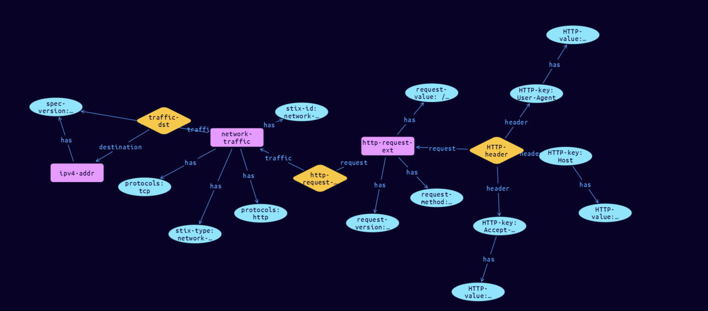

# Network-HTTP Cyber Obervable Object

**Stix and TypeQL Object Type:**  `http-request-ext`

The HTTP request extension specifies a default extension for capturing network traffic properties specific to HTTP requests. The key for this extension when used in the extensions dictionary MUST be http-request-ext. Note that this predefined extension does not use the extension facility described in section 7.3. The corresponding protocol value for this extension is http.

[Reference in Stix2.1 Standard](https://docs.oasis-open.org/cti/stix/v2.1/os/stix-v2.1-os.html#_b0e376hgtml8)
## Stix 2.1 Properties Converted to TypeQL
Mapping of the Stix Attack Pattern Properties to TypeDB

|  Stix 2.1 Property    |           Schema Name             | Required  Optional  |      Schema Object Type | Schema Parent  |
|:--------------------|:--------------------------------:|:------------------:|:------------------------:|:-------------:|
| request_method |request-method |Required |  stix-attribute-string    |   attribute    |
| request_value |request-value |      Optional       |  stix-attribute-string    |   attribute    |
| request_version |request-version |      Optional       |  stix-attribute-string    |   attribute    |
| request_header |HTTP-header:request |      Optional       |embedded |relation |
| message_body_length |message-body-length |      Optional       |  stix-attribute-integer    |   attribute    |
| message_body_data_ref |HTTP-body-data:HTPP-message |      Optional       |embedded |relation |

## The Example Network-HTTP in JSON
The original JSON, accessible in the Python environment
```json
{      
    "type": "network-traffic",      
    "spec_version": "2.1",      
    "id": "network-traffic--f8ae967a-3dc3-5cdf-8f94-8505abff00c2",      
    "dst_ref": "ipv4-addr--6da8dad3-4de3-5f8e-ab23-45d0b8f12f16",      
    "protocols": [      
      "tcp",      
      "http"      
    ],      
    "extensions": {      
      "http-request-ext": {      
        "request_method": "get",      
        "request_value": "/download.html",      
        "request_version": "http/1.1",      
        "request_header": {      
          "Accept-Encoding": "gzip,deflate",      
          "User-Agent": "Mozilla/5.0 (Windows; U; Windows NT 5.1; en-US; rv:1.6) Gecko/20040113",      
          "Host": "www.example.com"      
        }      
      }      
    }      
  }
```


## Inserting the Example Network-HTTP in TypeQL
The TypeQL insert statement
```typeql
match  $ipv4-addr0 isa ipv4-addr, has stix-id "ipv4-addr--6da8dad3-4de3-5f8e-ab23-45d0b8f12f16";
insert $network-traffic isa network-traffic,
 has stix-type $stix-type,
 has spec-version $spec-version,
 has stix-id $stix-id,
 has protocols $protocols0,
 has protocols $protocols1;

 $stix-type "network-traffic";
 $spec-version "2.1";
 $stix-id "network-traffic--f8ae967a-3dc3-5cdf-8f94-8505abff00c2";
 $protocols0 "tcp";
 $protocols1 "http";


 $traffic-dst0 (traffic:$network-traffic, destination:$ipv4-addr0) isa traffic-dst;
 $http-request-ext isa http-request-ext,
 has request-method $request-method,
 has request-value $request-value,
 has request-version $request-version;

 $request-method "get";
 $request-value "/download.html";
 $request-version "http/1.1";

 $http-request-extension (traffic:$network-traffic, request:$http-request-ext) isa http-request-extension;


 $HTTP-key0 isa HTTP-key;  $HTTP-key0 "Accept-Encoding";
 $HTTP-key0 has HTTP-value "gzip,deflate";
 $HTTP-key1 isa HTTP-key;  $HTTP-key1 "User-Agent";
 $HTTP-key1 has HTTP-value "Mozilla/5.0 (Windows; U; Windows NT 5.1; en-US; rv:1.6) Gecko/20040113";
 $HTTP-key2 isa HTTP-key;  $HTTP-key2 "Host";
 $HTTP-key2 has HTTP-value "www.example.com";
 $HTTP-header (request:$http-request-ext, header: $HTTP-key0, header: $HTTP-key1, header: $HTTP-key2) isa HTTP-header;
```

## Retrieving the Example Network-HTTP in TypeQL
The typeQL match statement

```typeql
match
    $a isa network-traffic,
        has stix-id "network-traffic--f8ae967a-3dc3-5cdf-8f94-8505abff00c2",
        has $b;
    $c (owner:$a, pointed-to:$d) isa embedded;
    $e isa stix-sub-object,
        has $f;
    $g (owner:$a, pointed-to:$e) isa embedded;
    $i has $j;
    $k (owner:$e, pointed-to:$i) isa embedded;
```


will retrieve the example attack-pattern object in Vaticle Studio


## Retrieving the Example Network-HTTP  in Python
The Python retrieval statement

```python
from stix.module.typedb_lib import TypeDBSink, TypeDBSource

connection = {
    "uri": "localhost",
    "port": "1729",
    "database": "stix",
    "user": None,
    "password": None
}

import_type = {
    "STIX21": True,
    "CVE": False,
    "identity": False,
    "location": False,
    "rules": False,
    "ATT&CK": False,
    "ATT&CK_Versions": ["12.0"],
    "ATT&CK_Domains": ["enterprise-attack", "mobile-attack", "ics-attack"],
    "CACAO": False
}

typedb = TypeDBSource(connection, import_type)
stix_obj = typedb.get("network-traffic--f8ae967a-3dc3-5cdf-8f94-8505abff00c2")
```

