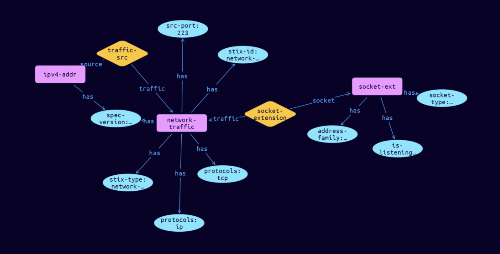

# Network-Socket Cyber Obervable Object

**Stix and TypeQL Object Type:**  `socket-ext`

The Network Socket extension specifies a default extension for capturing network traffic properties associated with network sockets. The key for this extension when used in the extensions dictionary MUST be socket-ext. Note that this predefined extension does not use the extension facility described in section 7.3.

[Reference in Stix2.1 Standard](https://docs.oasis-open.org/cti/stix/v2.1/os/stix-v2.1-os.html#_8jamupj9ubdv)
## Stix 2.1 Properties Converted to TypeQL
Mapping of the Stix Attack Pattern Properties to TypeDB

|  Stix 2.1 Property    |           Schema Name             | Required  Optional  |      Schema Object Type | Schema Parent  |
|:--------------------|:--------------------------------:|:------------------:|:------------------------:|:-------------:|
| address_family� |address-family |Required |  stix-attribute-string    |   attribute    |
| is_blocking� |is-blocking |Optional |  stix-attribute-string    |   attribute    |
| is_listening� |is-listening |Optional |  stix-attribute-string    |   attribute    |
| options� |socket-options:socket |Optional |embedded |relation |
| socket_type� |socket-type |Optional |  stix-attribute-string    |   attribute    |
| socket_descriptor� |socket-descriptor |Optional |  stix-attribute-string    |   attribute    |
| socket_handle� |socket-handle |Optional |  stix-attribute-string    |   attribute    |

## The Example Network-Socket in JSON
The original JSON, accessible in the Python environment
```json
{      
  "type": "network-traffic",      
  "spec_version": "2.1",      
  "id": "network-traffic--c95e972a-20a4-5307-b00d-b8393faf02c5",      
  "src_ref": "ipv4-addr--4d22aae0-2bf9-2754-8819-e4f6abf20a53",
  "src_port": 223,      
  "protocols": [      
    "ip",      
    "tcp"      
  ],      
  "extensions": {      
    "socket-ext": {      
      "is_listening": true,      
      "address_family": "AF_INET",      
      "socket_type": "SOCK_STREAM"      
    }      
  }      
}
```


## Inserting the Example Network-Socket in TypeQL
The TypeQL insert statement
```typeql
match
    $ipv4-addr0 isa ipv4-addr,
        has stix-id "ipv4-addr--4d22aae0-2bf9-2754-8819-e4f6abf20a53";
insert 
    $network-traffic isa network-traffic,
        has stix-type $stix-type,
        has spec-version $spec-version,
        has stix-id $stix-id,
        has src-port $src-port,
        has protocols $protocols0,
        has protocols $protocols1;
    
    $stix-type "network-traffic";
    $spec-version "2.1";
    $stix-id "network-traffic--c95e972a-20a4-5307-b00d-b8393faf02c5";
    $src-port 223;
    $protocols0 "ip";
    $protocols1 "tcp";
    
    $traffic-src0 (traffic:$network-traffic, source:$ipv4-addr0) isa traffic-src;
    $socket-ext isa socket-ext,
        has address-family $address-family,
        has is-listening $is-listening,
        has socket-type $socket-type;
    
    $address-family "AF_INET";
    $is-listening true;
    $socket-type "SOCK_STREAM";
    
    $socket-extension (traffic:$network-traffic, socket:$socket-ext) isa socket-extension;
```

## Retrieving the Example Network-Socket in TypeQL
The typeQL match statement

```typeql
match
    $a isa network-traffic,
        has stix-id  "network-traffic--c95e972a-20a4-5307-b00d-b8393faf02c5",
        has $b;
    $c (owner:$a, pointed-to:$d) isa embedded;
    $e isa stix-sub-object,
        has $f;
    $g (owner:$a, pointed-to:$e) isa embedded;
```


will retrieve the example attack-pattern object in Vaticle Studio


## Retrieving the Example Network-Socket  in Python
The Python retrieval statement

```python
from stix.module.typedb_lib import TypeDBSink, TypeDBSource

connection = {
    "uri": "localhost",
    "port": "1729",
    "database": "stix",
    "user": None,
    "password": None
}

import_type = {
    "STIX21": True,
    "CVE": False,
    "identity": False,
    "location": False,
    "rules": False,
    "ATT&CK": False,
    "ATT&CK_Versions": ["12.0"],
    "ATT&CK_Domains": ["enterprise-attack", "mobile-attack", "ics-attack"],
    "CACAO": False
}

typedb = TypeDBSource(connection, import_type)
stix_obj = typedb.get("network-traffic--c95e972a-20a4-5307-b00d-b8393faf02c5")
```

