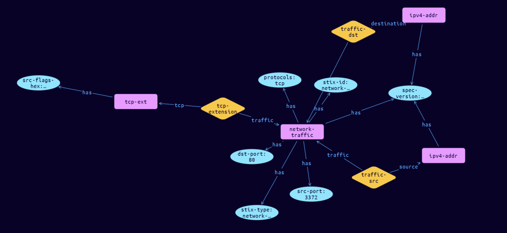

# Network-TCP Cyber Obervable Object

**Stix and TypeQL Object Type:**  `tcp-ext`

The TCP extension specifies a default extension for capturing network traffic properties specific to TCP. The key for this extension when used in the extensions dictionary MUST be tcp-ext. Note that this predefined extension does not use the extension facility described in section 7.3. The corresponding protocol value for this extension is tcp.

An object using the TCP Extension MUST contain at least one property from this extension

[Reference in Stix2.1 Standard](https://docs.oasis-open.org/cti/stix/v2.1/os/stix-v2.1-os.html#_k2njqio7f142)
## Stix 2.1 Properties Converted to TypeQL
Mapping of the Stix Attack Pattern Properties to TypeDB

|  Stix 2.1 Property    |           Schema Name             | Required  Optional  |      Schema Object Type | Schema Parent  |
|:--------------------|:--------------------------------:|:------------------:|:------------------------:|:-------------:|
| src_flags_hex |src-flags-hex |Optional |  stix-attribute-string    |   attribute    |
| dst_flags_hex |dst-flags-hex |Optional |  stix-attribute-string    |   attribute    |

## The Example Network-TCP in JSON
The original JSON, accessible in the Python environment
```json
{      
    "type": "network-traffic",      
    "spec_version": "2.1",      
    "id": "network-traffic--09ca55c3-97e5-5966-bad0-1d41d557ae13",      
    "src_ref": "ipv4-addr--89830c10-2e94-57fa-8ca6-e0537d2719d1",      
    "dst_ref": "ipv4-addr--45f4c6fb-2d7d-576a-a571-edc78d899a72",      
    "src_port": 3372,      
    "dst_port": 80,      
    "protocols": [      
      "tcp"      
    ],      
    "extensions": {      
      "tcp-ext": {      
        "src_flags_hex": "00000002"      
      }      
    }      
  }
```


## Inserting the Example Network-TCP in TypeQL
The TypeQL insert statement
```typeql
match  
    $ipv4-addr0 isa ipv4-addr, 
        has stix-id "ipv4-addr--89830c10-2e94-57fa-8ca6-e0537d2719d1";
    $ipv4-addr1 isa ipv4-addr, 
        has stix-id "ipv4-addr--45f4c6fb-2d7d-576a-a571-edc78d899a72";
insert 
    $network-traffic isa network-traffic,
        has stix-type $stix-type,
        has spec-version $spec-version,
        has stix-id $stix-id,
        has src-port $src-port,
        has dst-port $dst-port,
        has protocols $protocols0;
    
    $stix-type "network-traffic";
    $spec-version "2.1";
    $stix-id "network-traffic--09ca55c3-97e5-5966-bad0-1d41d557ae13";
    $src-port 3372;
    $dst-port 80;
    $protocols0 "tcp";
    
    $traffic-src0 (traffic:$network-traffic, source:$ipv4-addr0) isa traffic-src;
    
    $traffic-dst1 (traffic:$network-traffic, destination:$ipv4-addr1) isa traffic-dst;
    $tcp-ext isa tcp-ext,
        has src-flags-hex $src-flags-hex;
    
    $src-flags-hex "00000002";
    
    $tcp-extension (traffic:$network-traffic, tcp:$tcp-ext) isa tcp-extension;
```

## Retrieving the Example Network-TCP in TypeQL
The typeQL match statement

```typeql
match
    $a isa network-traffic,
        has stix-id  "network-traffic--09ca55c3-97e5-5966-bad0-1d41d557ae13",
        has $b;
    $c (owner:$a, pointed-to:$d) isa embedded;
    $e isa stix-sub-object,
        has $f;
    $g (owner:$a, pointed-to:$e) isa embedded;
```


will retrieve the example attack-pattern object in Vaticle Studio


## Retrieving the Example Network-TCP  in Python
The Python retrieval statement

```python
from stix.module.typedb_lib import TypeDBSink, TypeDBSource

connection = {
    "uri": "localhost",
    "port": "1729",
    "database": "stix",
    "user": None,
    "password": None
}

import_type = {
    "STIX21": True,
    "CVE": False,
    "identity": False,
    "location": False,
    "rules": False,
    "ATT&CK": False,
    "ATT&CK_Versions": ["12.0"],
    "ATT&CK_Domains": ["enterprise-attack", "mobile-attack", "ics-attack"],
    "CACAO": False
}

typedb = TypeDBSource(connection, import_type)
stix_obj = typedb.get("network-traffic--09ca55c3-97e5-5966-bad0-1d41d557ae13")
```

