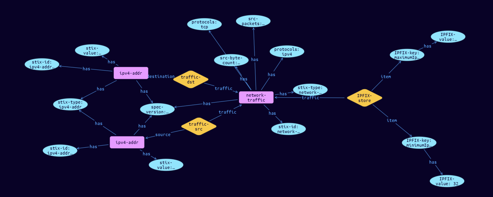

# Network-Traffic Cyber Obervable Object

**Stix and TypeQL Object Type:**  `network-traffic`

The Network Traffic object represents arbitrary network traffic that originates from a source and is addressed to a destination. The network traffic MAY or MAY NOT constitute a valid unicast, multicast, or broadcast network connection. This MAY also include traffic that is not established, such as a SYN flood.

To allow for use cases where a source or destination address may be sensitive and not suitable for sharing, such as addresses that are internal to an organization�s network, the source and destination properties (src_ref and dst_ref, respectively) are defined as optional in the properties table below. However, a Network Traffic object MUST contain the protocols property and at least one of the src_ref or dst_ref properties and SHOULD contain the src_port and dst_port properties.

[Reference in Stix2.1 Standard](https://docs.oasis-open.org/cti/stix/v2.1/os/stix-v2.1-os.html#_rgnc3w40xy)
## Stix 2.1 Properties Converted to TypeQL
Mapping of the Stix Attack Pattern Properties to TypeDB

|  Stix 2.1 Property    |           Schema Name             | Required  Optional  |      Schema Object Type | Schema Parent  |
|:--------------------|:--------------------------------:|:------------------:|:------------------------:|:-------------:|
|  type                 |            stix-type              |      Required       |  stix-attribute-string    |   attribute    |
|  id                   |             stix-id               |      Required       |  stix-attribute-string    |   attribute    |
|  spec_version         |           spec-version            |      Optional       |  stix-attribute-string    |   attribute    |
|  object_marking_refs  |      object-marking:marked        |      Optional       |   embedded     |relation |
|  granular_markings    |     granular-marking:marked       |      Optional       |   embedded     |relation |
| defanged |defanged |      Optional       |stix-attribute-boolean |   attribute    |
|  extensions           |               n/a                 |        n/a          |           n/a             |      n/a       |
| start� |start, |      Optional       |  stix-attribute-timestamp    |   attribute    |
| end� |end, |      Optional       |  stix-attribute-timestamp    |   attribute    |
| is_active� |is-active, |      Optional       |  stix-attribute-boolean    |   attribute    |
| src_ref� |traffic-src:traffic, |      Optional       |   embedded     |relation |
| dst_ref� |traffic-dst:traffic, |      Optional       |   embedded     |relation |
| src_port� |src-port, |      Optional       |  stix-attribute-integer    |   attribute    |
| dst_port� |dst-port, |      Optional       |  stix-attribute-integer    |   attribute    |
| protocols� |protocols, |      Optional       |  stix-attribute-string    |   attribute    |
| src_byte_count� |src-byte-count, |      Optional       |  stix-attribute-integer    |   attribute    |
| dst_byte_count� |dst-byte-count, |      Optional       |  stix-attribute-integer    |   attribute    |
| src_packets� |src-packets, |      Optional       |  stix-attribute-integer    |   attribute    |
| dst_packets� |dst-packets, |      Optional       |  stix-attribute-integer    |   attribute    |
| ipfix� |IPFIX-store:traffic |      Optional       |   embedded     |relation |
| src_payload_ref� |payload-src:traffic, |      Optional       |   embedded     |relation |
| dst_payload_ref� |payload-dst:traffic, |      Optional       |   embedded     |relation |
| encapsulates_refs� |encapsulate:container |      Optional       |   embedded     |relation |
| encapsulated_by_ref� |encapsulated:contained |      Optional       |   embedded     |relation |

## The Example Network-Traffic in JSON
The original JSON, accessible in the Python environment
```json
{      
    "type": "network-traffic",      
    "spec_version": "2.1",      
    "id": "network-traffic--630d7bb1-0bbc-53a6-a6d4-f3c2d35c2734",      
    "src_ref": "ipv4-addr--e42c19c8-f9fe-5ae9-9fc8-22c398f78fb7",      
    "dst_ref": "ipv4-addr--03b708d9-7761-2355-ab75-5ea096294a68",
    "protocols": [      
      "ipv4",      
      "tcp"      
    ],      
    "src_byte_count": 147600,      
    "src_packets": 100,      
    "ipfix": {      
      "minimumIpTotalLength": 32,      
      "maximumIpTotalLength": 2556      
    }      
  }
```


## Inserting the Example Network-Traffic in TypeQL
The TypeQL insert statement
```typeql
match  $ipv4-addr0 isa ipv4-addr, has stix-id "ipv4-addr--e42c19c8-f9fe-5ae9-9fc8-22c398f78fb7";
 $ipv4-addr1 isa ipv4-addr, has stix-id "ipv4-addr--03b708d9-7761-2355-ab75-5ea096294a68";
insert $network-traffic isa network-traffic,
 has stix-type $stix-type,
 has spec-version $spec-version,
 has stix-id $stix-id,
 has protocols $protocols0,
 has protocols $protocols1,
 has src-byte-count $src-byte-count,
 has src-packets $src-packets;

 $stix-type "network-traffic";
 $spec-version "2.1";
 $stix-id "network-traffic--630d7bb1-0bbc-53a6-a6d4-f3c2d35c2734";
 $protocols0 "ipv4";
 $protocols1 "tcp";
 $src-byte-count 147600;
 $src-packets 100;


 $traffic-src0 (traffic:$network-traffic, source:$ipv4-addr0) isa traffic-src;

 $traffic-dst1 (traffic:$network-traffic, destination:$ipv4-addr1) isa traffic-dst;

 $IPFIX-key0 isa IPFIX-key;  $IPFIX-key0 "minimumIpTotalLength";
 $IPFIX-key0 has IPFIX-value "32";
 $IPFIX-key1 isa IPFIX-key;  $IPFIX-key1 "maximumIpTotalLength";
 $IPFIX-key1 has IPFIX-value "2556";
 $IPFIX-store (traffic:$network-traffic, item: $IPFIX-key0, item: $IPFIX-key1) isa IPFIX-store;
```

## Retrieving the Example Network-Traffic in TypeQL
The typeQL match statement

```typeql
match
    $a isa network-traffic,
        has stix-id  "network-traffic--630d7bb1-0bbc-53a6-a6d4-f3c2d35c2734",
        has $b;
    $c (owner:$a, pointed-to:$d) isa embedded;
    $e has $f;
    $g (owner:$a, pointed-to:$e) isa embedded;
```


will retrieve the example attack-pattern object in Vaticle Studio


## Retrieving the Example Network-Traffic  in Python
The Python retrieval statement

```python
from stix.module.typedb_lib import TypeDBSink, TypeDBSource

connection = {
    "uri": "localhost",
    "port": "1729",
    "database": "stix",
    "user": None,
    "password": None
}

import_type = {
    "STIX21": True,
    "CVE": False,
    "identity": False,
    "location": False,
    "rules": False,
    "ATT&CK": False,
    "ATT&CK_Versions": ["12.0"],
    "ATT&CK_Domains": ["enterprise-attack", "mobile-attack", "ics-attack"],
    "CACAO": False
}

typedb = TypeDBSource(connection, import_type)
stix_obj = typedb.get("network-traffic--630d7bb1-0bbc-53a6-a6d4-f3c2d35c2734")
```

