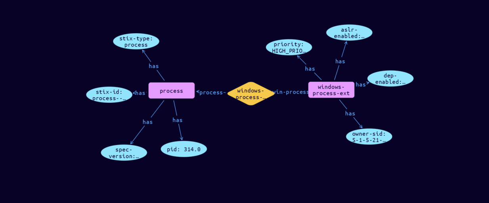

# Process-Windows-Process Cyber Obervable Object

**Stix and TypeQL Object Type:**  `windows-process-ext`

The Windows Process extension specifies a default extension for capturing properties specific to Windows processes. The key for this extension when used in the extensions dictionary MUST be windows-process-ext. Note that this predefined extension does not use the extension facility described in section 7.3.

An object using the Windows Process Extension MUST contain at least one property from this extension.

[Reference in Stix2.1 Standard](https://docs.oasis-open.org/cti/stix/v2.1/os/stix-v2.1-os.html#_oyegq07gjf5t)
## Stix 2.1 Properties Converted to TypeQL
Mapping of the Stix Attack Pattern Properties to TypeDB

|  Stix 2.1 Property    |           Schema Name             | Required  Optional  |      Schema Object Type | Schema Parent  |
|:--------------------|:--------------------------------:|:------------------:|:------------------------:|:-------------:|
| aslr_enabled  |aslr-enabled |Optional |  stix-attribute-string    |   attribute    |
| dep_enabled  |dep-enabled |Optional |  stix-attribute-boolean    |   attribute    |
| priority  |priority |Optional |  stix-attribute-string    |   attribute    |
| owner_sid  |owner-sid |Optional |  stix-attribute-string    |   attribute    |
| window_title  |window-title |Optional |  stix-attribute-string    |   attribute    |
| startup_info  |startup-info:process |Optional |embedded |relation |
| integrity_level   |integrity-level |Optional |  stix-attribute-string    |   attribute    |

## The Example Process-Windows-Process in JSON
The original JSON, accessible in the Python environment
```json
{
    "type": "process",  
    "spec_version": "2.1",  
    "id": "process--de02a3e4-4b96-460a-b799-684347004444",  
    "pid": 314,  
    "extensions": {  
      "windows-process-ext": {  
        "aslr_enabled": true,  
        "dep_enabled": true,  
        "priority": "HIGH_PRIORITY_CLASS",  
        "owner_sid": "S-1-5-21-186985262-1144665072-74031268-1309"  
      }  
    }  
  }
```


## Inserting the Example Process-Windows-Process in TypeQL
The TypeQL insert statement
```typeql
insert 
    $process isa process,
        has stix-type $stix-type,
        has spec-version $spec-version,
        has stix-id $stix-id,
        has pid $pid;
    
    $stix-type "process";
    $spec-version "2.1";
    $stix-id "process--de02a3e4-4b96-460a-b799-684347004444";
    $pid 314;
    
    $windows-process-ext isa windows-process-ext,
        has aslr-enabled $aslr-enabled,
        has dep-enabled $dep-enabled,
        has priority $priority,
        has owner-sid $owner-sid;
    
    $aslr-enabled true;
    $dep-enabled true;
    $priority "HIGH_PRIORITY_CLASS";
    $owner-sid "S-1-5-21-186985262-1144665072-74031268-1309";
    
    $windows-process-extension (process:$process, win-process:$windows-process-ext) isa windows-process-extension;
```

## Retrieving the Example Process-Windows-Process in TypeQL
The typeQL match statement

```typeql
match
    $a isa process,
        has stix-id  "process--de02a3e4-4b96-460a-b799-684347004444",
        has $b;
    $c (owner:$a, pointed-to:$d) isa embedded;
    $d isa stix-sub-object,
        has $e;
```


will retrieve the example attack-pattern object in Vaticle Studio


## Retrieving the Example Process-Windows-Process  in Python
The Python retrieval statement

```python
from stix.module.typedb import TypeDBSink, TypeDBSource
connection = {
    "uri": "localhost",
    "port": "1729",
    "database": "stix",
    "user": None,
    "password": None
}

import_type = {
    "STIX21": True,
    "CVE": False,
    "identity": False,
    "location": False,
    "rules": False,
    "ATT&CK": False,
    "ATT&CK_Versions": ["12.0"],
    "ATT&CK_Domains": ["enterprise-attack", "mobile-attack", "ics-attack"],
    "CACAO": False
}

typedb = TypeDBSource(connection, import_type)
stix_obj = typedb.get("process--de02a3e4-4b96-460a-b799-684347004444")
```

