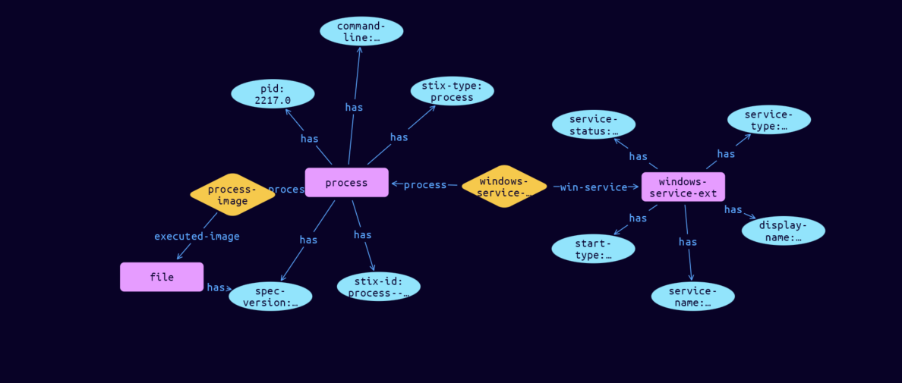

# Process-Windows-Service Cyber Obervable Object

**Stix and TypeQL Object Type:**  `windows-service-ext`

The Windows Service extension specifies a default extension for capturing properties specific to Windows services. The key for this extension when used in the extensions dictionary MUST be windows-service-ext. Note that this predefined extension does not use the extension facility described in section 7.3.

As all properties of this extension are optional, at least one of the properties defined below MUST be included when using this extension.

[Reference in Stix2.1 Standard](https://docs.oasis-open.org/cti/stix/v2.1/os/stix-v2.1-os.html#_lbcvc2ahx1s0)
## Stix 2.1 Properties Converted to TypeQL
Mapping of the Stix Attack Pattern Properties to TypeDB

|  Stix 2.1 Property    |           Schema Name             | Required  Optional  |      Schema Object Type | Schema Parent  |
|:--------------------|:--------------------------------:|:------------------:|:------------------------:|:-------------:|
| service_name� |service-name |Optional |  stix-attribute-string    |   attribute    |
| descriptions� |description |Optional |  stix-attribute-string    |   attribute    |
| display_name� |display-name |Optional |  stix-attribute-string    |   attribute    |
| group_name� |group-name |Optional |  stix-attribute-string    |   attribute    |
| start_type� |start-type |Optional |  stix-attribute-string    |   attribute    |
| service_dll_refs� |service-dll:process |Optional |embedded |relation |
| service_type� |service-type |Optional |  stix-attribute-string    |   attribute    |
| service_status� |service-status |Optional |  stix-attribute-string    |   attribute    |

## The Example Process-Windows-Service in JSON
The original JSON, accessible in the Python environment
```json
{      
    "type": "process",      
    "spec_version": "2.1",      
    "id": "process--70b17c6c-93e5-4c80-8683-5a4d4e51f2c1",      
    "pid": 2217,      
    "command_line": "C:\\Windows\\System32\\sirvizio.exe /s",      
    "image_ref": "file--c7d1e135-8b34-549a-bb47-302f5cf998ed",      
    "extensions": {      
      "windows-service-ext": {      
        "service_name": "sirvizio",      
        "display_name": "Sirvizio",      
        "start_type": "SERVICE_AUTO_START",      
        "service_type": "SERVICE_WIN32_OWN_PROCESS",      
        "service_status": "SERVICE_RUNNING"      
      }      
    }      
  }
```


## Inserting the Example Process-Windows-Service in TypeQL
The TypeQL insert statement
```typeql
match  
    $file0 isa file, 
        has stix-id "file--c7d1e135-8b34-549a-bb47-302f5cf998ed";
insert 
    $process isa process,
        has stix-type $stix-type,
        has spec-version $spec-version,
        has stix-id $stix-id,
        has pid $pid,
        has command-line $command-line;
    
    $stix-type "process";
    $spec-version "2.1";
    $stix-id "process--70b17c6c-93e5-4c80-8683-5a4d4e51f2c1";
    $pid 2217;
    $command-line "C:\\Windows\\System32\\sirvizio.exe /s";
    
    $process-image0 (process:$process, executed-image:$file0) isa process-image;
    $windows-service-ext isa windows-service-ext,
        has service-name $service-name,
        has display-name $display-name,
        has start-type $start-type,
        has service-type $service-type,
        has service-status $service-status;
    
    $service-name "sirvizio";
    $display-name "Sirvizio";
    $start-type "SERVICE_AUTO_START";
    $service-type "SERVICE_WIN32_OWN_PROCESS";
    $service-status "SERVICE_RUNNING";
    
    $windows-service-extension (process:$process, win-service:$windows-service-ext) isa windows-service-extension;
```

## Retrieving the Example Process-Windows-Service in TypeQL
The typeQL match statement

```typeql
match
    $a isa process,
        has stix-id  "process--70b17c6c-93e5-4c80-8683-5a4d4e51f2c1",
        has $b;
    $c (owner:$a, pointed-to:$d) isa embedded;
    $d isa stix-sub-object,
        has $e;
    $f (owner:$a, pointed-to:$g) isa embedded;
```


will retrieve the example attack-pattern object in Vaticle Studio


## Retrieving the Example Process-Windows-Service  in Python
The Python retrieval statement

```python
from stix.module.typedb_lib import TypeDBSink, TypeDBSource

connection = {
    "uri": "localhost",
    "port": "1729",
    "database": "stix",
    "user": None,
    "password": None
}

import_type = {
    "STIX21": True,
    "CVE": False,
    "identity": False,
    "location": False,
    "rules": False,
    "ATT&CK": False,
    "ATT&CK_Versions": ["12.0"],
    "ATT&CK_Domains": ["enterprise-attack", "mobile-attack", "ics-attack"],
    "CACAO": False
}

typedb = TypeDBSource(connection, import_type)
stix_obj = typedb.get("process--70b17c6c-93e5-4c80-8683-5a4d4e51f2c1")
```

