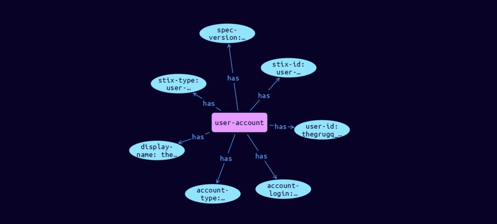

# User-Account Cyber Obervable Object

**Stix and TypeQL Object Type:**  `user-account`

The User Account object represents an instance of any type of user account, including but not limited to operating system, device, messaging service, and social media platform accounts. As all properties of this object are optional, at least one of the properties defined below MUST be included when using this object.

[Reference in Stix2.1 Standard](https://docs.oasis-open.org/cti/stix/v2.1/os/stix-v2.1-os.html#_azo70vgj1vm2)
## Stix 2.1 Properties Converted to TypeQL
Mapping of the Stix Attack Pattern Properties to TypeDB

|  Stix 2.1 Property    |           Schema Name             | Required  Optional  |      Schema Object Type | Schema Parent  |
|:--------------------|:--------------------------------:|:------------------:|:------------------------:|:-------------:|
|  type                 |            stix-type              |      Required       |  stix-attribute-string    |   attribute    |
|  id                   |             stix-id               |      Required       |  stix-attribute-string    |   attribute    |
|  spec_version         |           spec-version            |      Optional       |  stix-attribute-string    |   attribute    |
|  object_marking_refs  |      object-marking:marked        |      Optional       |   embedded     |relation |
|  granular_markings    |     granular-marking:marked       |      Optional       |   embedded     |relation |
| defanged |defanged |      Optional       |stix-attribute-boolean |   attribute    |
|  extensions           |               n/a                 |        n/a          |           n/a             |      n/a       |
| user_id |user-id |      Optional       |  stix-attribute-string    |   attribute    |
| �credential |credential |      Optional       |  stix-attribute-string    |   attribute    |
| �account_login |account-login |      Optional       |  stix-attribute-string    |   attribute    |
| �account_type |account-type |      Optional       |  stix-attribute-string    |   attribute    |
| �display_name |display-name |      Optional       |  stix-attribute-string    |   attribute    |
| �is_service_account |is-service-account |      Optional       |  stix-attribute-boolean    |   attribute    |
| �is_privileged |is-privileged |      Optional       |  stix-attribute-boolean    |   attribute    |
| �can_escalate_privs |can-escalate-privs |      Optional       |  stix-attribute-boolean    |   attribute    |
| �is_disabled |is-disabled |      Optional       |  stix-attribute-boolean    |   attribute    |
| �account_created |account-created |      Optional       |  stix-attribute-timestamp    |   attribute    |
| �account_expires |account-expires |      Optional       |  stix-attribute-timestamp    |   attribute    |
| �credential_last_changed |credential-last-changed |      Optional       |  stix-attribute-timestamp    |   attribute    |
| �account_first_login |account-first-login |      Optional       |  stix-attribute-timestamp    |   attribute    |
| �account_last_login |account-last-login |      Optional       |  stix-attribute-timestamp    |   attribute    |

## The Example User-Account in JSON
The original JSON, accessible in the Python environment
```json
{
    "type": "user-account",  
    "spec_version": "2.1",  
    "id": "user-account--9bd3afcf-deee-54f9-83e2-520653cb6bba",  
    "user_id": "thegrugq_ebooks",  
    "account_login": "thegrugq_ebooks",  
    "account_type": "twitter",  
    "display_name": "the grugq"  
  }
```


## Inserting the Example User-Account in TypeQL
The TypeQL insert statement
```typeql
insert 
    $user-account isa user-account,
        has stix-type $stix-type,
        has spec-version $spec-version,
        has stix-id $stix-id,
        has user-id $user-id,
        has account-login $account-login,
        has account-type $account-type,
        has display-name $display-name;
    
    $stix-type "user-account";
    $spec-version "2.1";
    $stix-id "user-account--9bd3afcf-deee-54f9-83e2-520653cb6bba";
    $user-id "thegrugq_ebooks";
    $account-login "thegrugq_ebooks";
    $account-type "twitter";
    $display-name "the grugq";
```

## Retrieving the Example User-Account in TypeQL
The typeQL match statement

```typeql
match
    $a isa user-account,
        has stix-id  "user-account--9bd3afcf-deee-54f9-83e2-520653cb6bba",
        has $b;
```


will retrieve the example attack-pattern object in Vaticle Studio


## Retrieving the Example User-Account  in Python
The Python retrieval statement

```python
from stix.module.typedb_lib import TypeDBSink, TypeDBSource

connection = {
    "uri": "localhost",
    "port": "1729",
    "database": "stix",
    "user": None,
    "password": None
}

import_type = {
    "STIX21": True,
    "CVE": False,
    "identity": False,
    "location": False,
    "rules": False,
    "ATT&CK": False,
    "ATT&CK_Versions": ["12.0"],
    "ATT&CK_Domains": ["enterprise-attack", "mobile-attack", "ics-attack"],
    "CACAO": False
}

typedb = TypeDBSource(connection, import_type)
stix_obj = typedb.get("user-account--9bd3afcf-deee-54f9-83e2-520653cb6bba")
```

