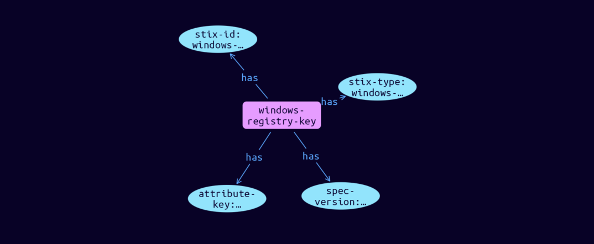

# Windows-Registry-Key Cyber Obervable Object

**Stix and TypeQL Object Type:**  `windows-registry-key`

The Registry Key object represents the properties of a Windows registry key. As all properties of this object are optional, at least one of the properties defined below MUST be included when using this object.

[Reference in Stix2.1 Standard](https://docs.oasis-open.org/cti/stix/v2.1/os/stix-v2.1-os.html#_luvw8wjlfo3y)
## Stix 2.1 Properties Converted to TypeQL
Mapping of the Stix Attack Pattern Properties to TypeDB

|  Stix 2.1 Property    |           Schema Name             | Required  Optional  |      Schema Object Type | Schema Parent  |
|:--------------------|:--------------------------------:|:------------------:|:------------------------:|:-------------:|
|  type                 |            stix-type              |      Required       |  stix-attribute-string    |   attribute    |
|  id                   |             stix-id               |      Required       |  stix-attribute-string    |   attribute    |
|  spec_version         |           spec-version            |      Optional       |  stix-attribute-string    |   attribute    |
|  object_marking_refs  |      object-marking:marked        |      Optional       |   embedded     |relation |
|  granular_markings    |     granular-marking:marked       |      Optional       |   embedded     |relation |
| defanged |defanged |      Optional       |stix-attribute-boolean |   attribute    |
|  extensions           |               n/a                 |        n/a          |           n/a             |      n/a       |
| key |attribute-key |      Optional       |  stix-attribute-string    |   attribute    |
| �values |reg-val:reg-key |      Optional       |embedded |relation |
| �modified_time |modified-time |      Optional       |  stix-attribute-timestamp    |   attribute    |
| �creator_user_ref |user-created-by:created |      Optional       |embedded |relation |
| �number_of_subkeys |number-subkeys |      Optional       |  stix-attribute-integer    |   attribute    |

## The Example Windows-Registry-Key in JSON
The original JSON, accessible in the Python environment
```json
{
    "type": "windows-registry-key",  
    "spec_version": "2.1",  
    "id": "windows-registry-key--9d60798d-4e3e-5fe4-af8a-0e4986f0f90b",  
    "key": "HKEY_LOCAL_MACHINE\\System\\Foo\\Bar"  
  }
```


## Inserting the Example Windows-Registry-Key in TypeQL
The TypeQL insert statement
```typeql
insert 
    $windows-registry-key isa windows-registry-key,
        has stix-type $stix-type,
        has spec-version $spec-version,
        has stix-id $stix-id,
        has attribute-key $attribute-key;
    
    $stix-type "windows-registry-key";
    $spec-version "2.1";
    $stix-id "windows-registry-key--9d60798d-4e3e-5fe4-af8a-0e4986f0f90b";
    $attribute-key "HKEY_LOCAL_MACHINE\\System\\Foo\\Bar";
```

## Retrieving the Example Windows-Registry-Key in TypeQL
The typeQL match statement

```typeql
match
    $a isa windows-registry-key,
        has stix-id  "windows-registry-key--9d60798d-4e3e-5fe4-af8a-0e4986f0f90b",
        has $b;
```


will retrieve the example attack-pattern object in Vaticle Studio


## Retrieving the Example Windows-Registry-Key  in Python
The Python retrieval statement

```python
from stix.module.typedb_lib import TypeDBSink, TypeDBSource

connection = {
    "uri": "localhost",
    "port": "1729",
    "database": "stix",
    "user": None,
    "password": None
}

import_type = {
    "STIX21": True,
    "CVE": False,
    "identity": False,
    "location": False,
    "rules": False,
    "ATT&CK": False,
    "ATT&CK_Versions": ["12.0"],
    "ATT&CK_Domains": ["enterprise-attack", "mobile-attack", "ics-attack"],
    "CACAO": False
}

typedb = TypeDBSource(connection, import_type)
stix_obj = typedb.get
"windows-registry-key--9d60798d-4e3e-5fe4-af8a-0e4986f0f90b")
```

