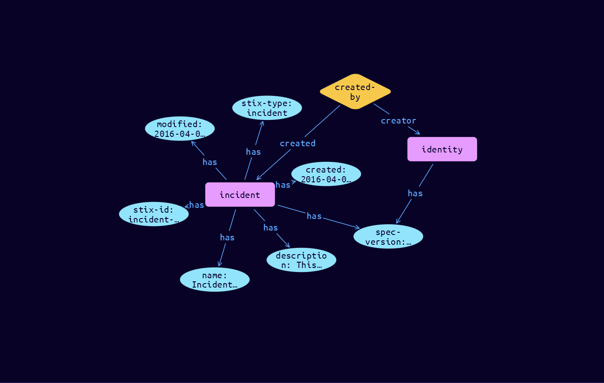

# Incident Domain Object

**Stix and TypeQL Object Type:**  `incident`

Note: The Incident object in STIX 2.1 is a stub. It is included to support basic use cases but does not contain properties to represent metadata about incidents. Future STIX 2 releases will expand it to include these capabilities.  It is suggested that it is used as an extension point for an Incident object defined using the extension facility described in section 7.3.

[Reference in Stix2.1 Standard](https://docs.oasis-open.org/cti/stix/v2.1/os/stix-v2.1-os.html#_sczfhw64pjxt)
## Stix 2.1 Properties Converted to TypeQL
Mapping of the Stix Attack Pattern Properties to TypeDB

|  Stix 2.1 Property    |           Schema Name             | Required  Optional  |      Schema Object Type | Schema Parent  |
|:--------------------|:--------------------------------:|:------------------:|:------------------------:|:-------------:|
|  type                 |            stix-type              |      Required       |  stix-attribute-string    |   attribute    |
|  id                   |             stix-id               |      Required       |  stix-attribute-string    |   attribute    |
|  spec_version         |           spec-version            |      Required       |  stix-attribute-string    |   attribute    |
|  created              |             created               |      Required       | stix-attribute-timestamp  |   attribute    |
|  modified             |             modified              |      Required       | stix-attribute-timestamp  |   attribute    |
|  name                 |               name                |      Optional       |  stix-attribute-string    |   attribute    |
|  description          |           description             |      Optional       |  stix-attribute-string    |   attribute    |
|  created_by_ref       |        created-by:created         |      Optional       |   embedded     |relation |
|  revoked              |             revoked               |      Optional       |  stix-attribute-boolean   |   attribute    |
|  labels               |              labels               |      Optional       |  stix-attribute-string    |   attribute    |
|  confidence           |            confidence             |      Optional       |  stix-attribute-integer   |   attribute    |
|  lang                 |               lang                |      Optional       |  stix-attribute-string    |   attribute    |
|  external_references  | external-references:referencing   |      Optional       |   embedded     |relation |
|  object_marking_refs  |      object-marking:marked        |      Optional       |   embedded     |relation |
|  granular_markings    |     granular-marking:marked       |      Optional       |   embedded     |relation |
|  extensions           |               n/a                 |        n/a          |           n/a             |      n/a       |

## The Example Incident in JSON
The original JSON, accessible in the Python environment
```json
{
    "type": "incident",
    "spec_version": "2.1",
    "id": "incident--8e2e2d2b-17d4-4cbf-938f-98ee46b3cd3f",
    "created_by_ref": "identity--e5f1b90a-d9b6-40ab-81a9-8a29df4b6b65",
    "created": "2016-04-06T20:03:48.000Z",
    "modified": "2016-04-06T20:03:48.000Z",
    "name": "Incident 43",
    "description": "This incident addresses APT 28 ..."
  }
```


## Inserting the Example Incident in TypeQL
The TypeQL insert statement
```typeql
match  
    $identity0 isa identity, 
        has stix-id "identity--e5f1b90a-d9b6-40ab-81a9-8a29df4b6b65";
insert 
    $incident isa incident,
        has stix-type $stix-type,
        has spec-version $spec-version,
        has stix-id $stix-id,
        has created $created,
        has modified $modified,
        has name $name,
        has description $description;
    
    $stix-type "incident";
    $spec-version "2.1";
    $stix-id "incident--8e2e2d2b-17d4-4cbf-938f-98ee46b3cd3f";
    $created 2016-04-06T20:03:48.000;
    $modified 2016-04-06T20:03:48.000;
    $name "Incident 43";
    $description "This incident addresses APT 28 ...";
    
    $created-by0 (created:$incident, creator:$identity0) isa created-by;
```

## Retrieving the Example Incident in TypeQL
The typeQL match statement

```typeql
match
    $a isa incident,
        has stix-id "incident--8e2e2d2b-17d4-4cbf-938f-98ee46b3cd3f",
        has $b;
    $c (owner:$a, pointed-to:$d) isa embedded;
```


will retrieve the example attack-pattern object in Vaticle Studio


## Retrieving the Example Incident  in Python
The Python retrieval statement

```python
from stix.module.typedb_lib import TypeDBSink, TypeDBSource

connection = {
    "uri": "localhost",
    "port": "1729",
    "database": "stix",
    "user": None,
    "password": None
}

import_type = {
    "STIX21": True,
    "CVE": False,
    "identity": False,
    "location": False,
    "rules": False,
    "ATT&CK": False,
    "ATT&CK_Versions": ["12.0"],
    "ATT&CK_Domains": ["enterprise-attack", "mobile-attack", "ics-attack"],
    "CACAO": False
}

typedb = TypeDBSource(connection, import_type)
stix_obj = typedb.get("incident--8e2e2d2b-17d4-4cbf-938f-98ee46b3cd3f")
```

