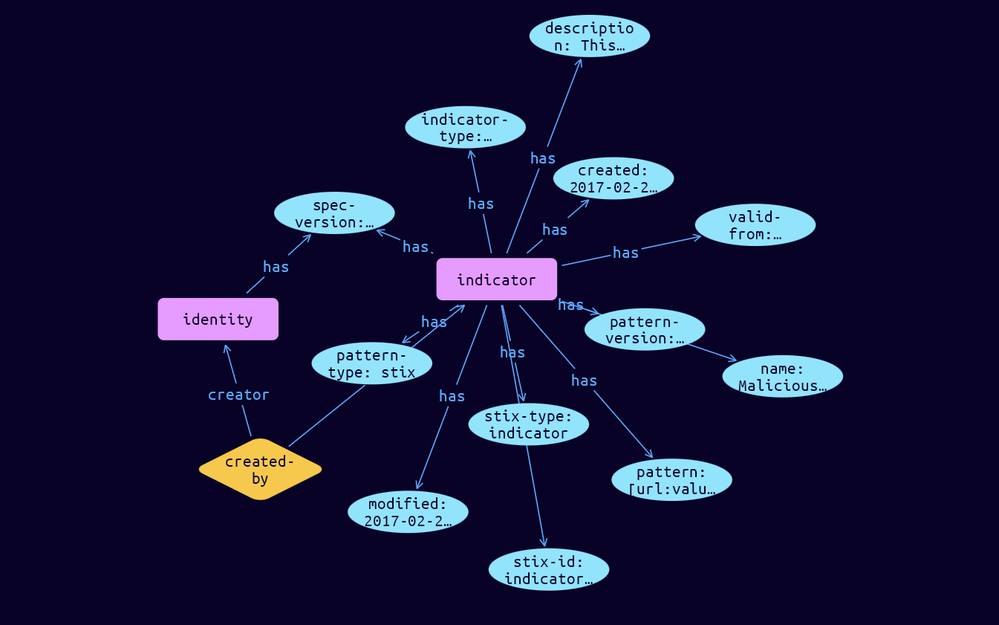

# Indicator Domain Object

**Stix and TypeQL Object Type:**  `indicator`

Indicators contain a pattern that can be used to detect suspicious or malicious cyber activity. For example, an Indicator may be used to represent a set of malicious domains and use the STIX Patterning Language (see section 9) to specify these domains.

 

The Indicator SDO contains a simple textual description, the Kill Chain Phases that it detects behavior in, a time window for when the Indicator is valid or useful, and a required pattern property to capture a structured detection pattern. Conforming STIX implementations MUST support the STIX Patterning Language as defined in section 9.

Relationships from the Indicator can describe the malicious or suspicious behavior that it directly detects (Malware, Tool, and Attack Pattern). In addition, it may also imply the presence of a Campaigns, Intrusion Sets, and Threat Actors, etc.

[Reference in Stix2.1 Standard](https://docs.oasis-open.org/cti/stix/v2.1/os/stix-v2.1-os.html#_muftrcpnf89v)
## Stix 2.1 Properties Converted to TypeQL
Mapping of the Stix Attack Pattern Properties to TypeDB

|  Stix 2.1 Property    |           Schema Name             | Required  Optional  |      Schema Object Type | Schema Parent  |
|:--------------------|:--------------------------------:|:------------------:|:------------------------:|:-------------:|
|  type                 |            stix-type              |      Required       |  stix-attribute-string    |   attribute    |
|  id                   |             stix-id               |      Required       |  stix-attribute-string    |   attribute    |
|  spec_version         |           spec-version            |      Required       |  stix-attribute-string    |   attribute    |
|  created              |             created               |      Required       | stix-attribute-timestamp  |   attribute    |
|  modified             |             modified              |      Required       | stix-attribute-timestamp  |   attribute    |
|  name                 |               name                |      Optional       |  stix-attribute-string    |   attribute    |
|  description          |           description             |      Optional       |  stix-attribute-string    |   attribute    |
| indicator_types |indicator_types |      Optional       |  stix-attribute-string    |   attribute    |
| pattern |pattern |      Required       |  stix-attribute-string    |   attribute    |
| pattern_type |pattern_type |      Required       |  stix-attribute-string    |   attribute    |
| pattern_version |pattern_version |      Optional       |  stix-attribute-string    |   attribute    |
| valid_from |valid_from |      Required       | stix-attribute-timestamp  |   attribute    |
| valid_until |valid_until |      Optional       | stix-attribute-timestamp  |   attribute    |
| kill_chain_phases |kill-chain-usage:kill-chain-using |      Optional       |   embedded     |relation |
|  created_by_ref       |        created-by:created         |      Optional       |   embedded     |relation |
|  revoked              |             revoked               |      Optional       |  stix-attribute-boolean   |   attribute    |
|  labels               |              labels               |      Optional       |  stix-attribute-string    |   attribute    |
|  confidence           |            confidence             |      Optional       |  stix-attribute-integer   |   attribute    |
|  lang                 |               lang                |      Optional       |  stix-attribute-string    |   attribute    |
|  external_references  | external-references:referencing   |      Optional       |   embedded     |relation |
|  object_marking_refs  |      object-marking:marked        |      Optional       |   embedded     |relation |
|  granular_markings    |     granular-marking:marked       |      Optional       |   embedded     |relation |
|  extensions           |               n/a                 |        n/a          |           n/a             |      n/a       |

## The Example Indicator in JSON
The original JSON, accessible in the Python environment
```json
{
    "type": "indicator",
    "spec_version": "2.1",
    "id": "indicator--9299f726-ce06-492e-8472-2b52ccb53191",
    "created_by_ref": "identity--39012926-a052-44c4-ae48-caaf4a10ee6e",
    "created": "2017-02-27T13:57:10.515Z",
    "modified": "2017-02-27T13:57:10.515Z",
    "name": "Malicious URL",
    "description": "This URL is potentially associated with malicious activity and is listed on several blacklist sites.",
    "indicator_types": [
        "malicious-activity"
    ],
    "pattern": "[url:value = 'http://paypa1.banking.com']",
    "pattern_type": "stix",
    "valid_from": "2015-06-29T09:10:15.915Z"
}
```


## Inserting the Example Indicator in TypeQL
The TypeQL insert statement
```typeql
match  
    $identity0 isa identity, 
        has stix-id "identity--39012926-a052-44c4-ae48-caaf4a10ee6e";
insert
    $indicator isa indicator,
         has stix-type $stix-type,
         has spec-version $spec-version,
         has stix-id $stix-id,
         has created $created,
         has modified $modified,
         has name $name,
         has description $description,
         has indicator-type $indicator_types0,
         has pattern $pattern,
         has pattern-type $pattern-type,
         has pattern-version $pattern-version,
         has valid-from $valid-from;

    $stix-type "indicator";
    $spec-version "2.1";
    $stix-id "indicator--9299f726-ce06-492e-8472-2b52ccb53191";
    $created 2017-02-27T13:57:10.515;
    $modified 2017-02-27T13:57:10.515;
    $name "Malicious URL";
    $description "This URL is potentially associated with malicious activity and is listed on several blacklist sites.";
    $indicator_types0 "malicious-activity";
    $pattern "[url:value = 'http://paypa1.banking.com']";
    $pattern-type "stix";
    $pattern-version "2.1";
    $valid-from 2015-06-29T09:10:15.915;


    $created-by0 (created:$indicator, creator:$identity0) isa created-by;
```

## Retrieving the Example Indicator in TypeQL
The typeQL match statement

```typeql
match
    $a isa indicator,
        has stix-id "indicator--9299f726-ce06-492e-8472-2b52ccb53191",
        has $b;
    $e (owner:$a, pointed-to:$c) isa embedded;
```


will retrieve the example attack-pattern object in Vaticle Studio


## Retrieving the Example Indicator  in Python
The Python retrieval statement

```python
from stix.module.typedb_lib import TypeDBSink, TypeDBSource

connection = {
    "uri": "localhost",
    "port": "1729",
    "database": "stix",
    "user": None,
    "password": None
}

import_type = {
    "STIX21": True,
    "CVE": False,
    "identity": False,
    "location": False,
    "rules": False,
    "ATT&CK": False,
    "ATT&CK_Versions": ["12.0"],
    "ATT&CK_Domains": ["enterprise-attack", "mobile-attack", "ics-attack"],
    "CACAO": False
}

typedb = TypeDBSource(connection, import_type)
stix_obj = typedb.get("indicator--1ed8caa7-a708-4706-b651-f1186ede6ca1")
```

