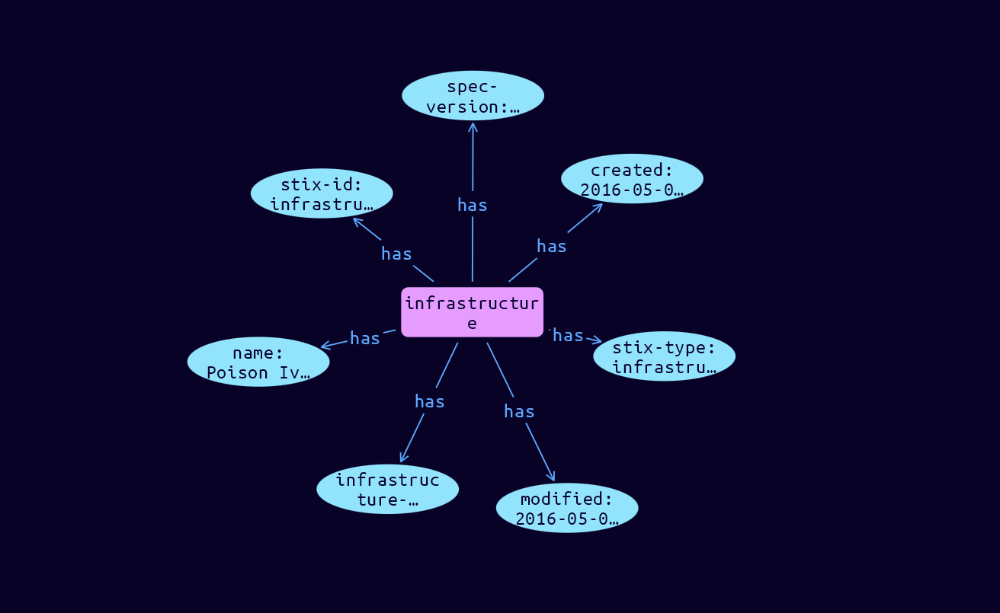

# Infrastructure Domain Object

**Stix and TypeQL Object Type:**  `infrastructure`

The Infrastructure SDO represents a type of TTP and describes any systems, software services and any associated physical or virtual resources intended to support some purpose (e.g., C2 servers used as part of an attack, device or server that are part of defense, database servers targeted by an attack, etc.). While elements of an attack can be represented by other SDOs or SCOs, the Infrastructure SDO represents a named group of related data that constitutes the infrastructure.

[Reference in Stix2.1 Standard](https://docs.oasis-open.org/cti/stix/v2.1/os/stix-v2.1-os.html#_jo3k1o6lr9)
## Stix 2.1 Properties Converted to TypeQL
Mapping of the Stix Attack Pattern Properties to TypeDB

|  Stix 2.1 Property    |           Schema Name             | Required  Optional  |      Schema Object Type | Schema Parent  |
|:--------------------|:--------------------------------:|:------------------:|:------------------------:|:-------------:|
|  type                 |            stix-type              |      Required       |  stix-attribute-string    |   attribute    |
|  id                   |             stix-id               |      Required       |  stix-attribute-string    |   attribute    |
|  spec_version         |           spec-version            |      Required       |  stix-attribute-string    |   attribute    |
|  created              |             created               |      Required       | stix-attribute-timestamp  |   attribute    |
|  modified             |             modified              |      Required       | stix-attribute-timestamp  |   attribute    |
|  name                 |               name                |      Optional       |  stix-attribute-string    |   attribute    |
|  description          |           description             |      Optional       |  stix-attribute-string    |   attribute    |
| infrastructure_types |infrastructure-types |      Optional       |  stix-attribute-string    |   attribute    |
| aliases |aliases |      Optional       |  stix-attribute-string    |   attribute    |
| kill_chain_phases |kill-chain-usage:kill-chain-using |      Optional       |   embedded     |relation |
| first_seen |first_seen |      Optional       | stix-attribute-timestamp  |   attribute    |
| last_seen |last-seen |      Optional       | stix-attribute-timestamp  |   attribute    |
|  created_by_ref       |        created-by:created         |      Optional       |   embedded     |relation |
|  revoked              |             revoked               |      Optional       |  stix-attribute-boolean   |   attribute    |
|  labels               |              labels               |      Optional       |  stix-attribute-string    |   attribute    |
|  confidence           |            confidence             |      Optional       |  stix-attribute-integer   |   attribute    |
|  lang                 |               lang                |      Optional       |  stix-attribute-string    |   attribute    |
|  external_references  | external-references:referencing   |      Optional       |   embedded     |relation |
|  object_marking_refs  |      object-marking:marked        |      Optional       |   embedded     |relation |
|  granular_markings    |     granular-marking:marked       |      Optional       |   embedded     |relation |
|  extensions           |               n/a                 |        n/a          |           n/a             |      n/a       |

## The Example Infrastructure in JSON
The original JSON, accessible in the Python environment
```json
{
    "type":"infrastructure",      
    "spec_version": "2.1",      
    "id":"infrastructure--38c47d93-d984-4fd9-b87b-d69d0841628d",      
    "created":"2016-05-07T11:22:30.000Z",      
    "modified":"2016-05-07T11:22:30.000Z",      
    "name":"Poison Ivy C2",      
    "infrastructure_types": ["command-and-control"]      
  }
```


## Inserting the Example Infrastructure in TypeQL
The TypeQL insert statement
```typeql
insert $infrastructure isa infrastructure,
 has stix-type $stix-type,
 has spec-version $spec-version,
 has stix-id $stix-id,
 has created $created,
 has modified $modified,
 has name $name,
 has infrastructure-types $infrastructure_types0;

 $stix-type "infrastructure";
 $spec-version "2.1";
 $stix-id "infrastructure--38c47d93-d984-4fd9-b87b-d69d0841628d";
 $created 2016-05-07T11:22:30.000;
 $modified 2016-05-07T11:22:30.000;
 $name "Poison Ivy C2";
 $infrastructure_types0 "command-and-control";
```

## Retrieving the Example Infrastructure in TypeQL
The typeQL match statement

```typeql
match
    $a isa infrastructure,
        has stix-id "infrastructure--38c47d93-d984-4fd9-b87b-d69d0841628d",
        has $b;
```


will retrieve the example attack-pattern object in Vaticle Studio


## Retrieving the Example Infrastructure  in Python
The Python retrieval statement

```python
from stix.module.typedb_lib import TypeDBSink, TypeDBSource

connection = {
    "uri": "localhost",
    "port": "1729",
    "database": "stix",
    "user": None,
    "password": None
}

import_type = {
    "STIX21": True,
    "CVE": False,
    "identity": False,
    "location": False,
    "rules": False,
    "ATT&CK": False,
    "ATT&CK_Versions": ["12.0"],
    "ATT&CK_Domains": ["enterprise-attack", "mobile-attack", "ics-attack"],
    "CACAO": False
}

typedb = TypeDBSource(connection, import_type)
stix_obj = typedb.get("infrastructure--38c47d93-d984-4fd9-b87b-d69d0841628d")
```

