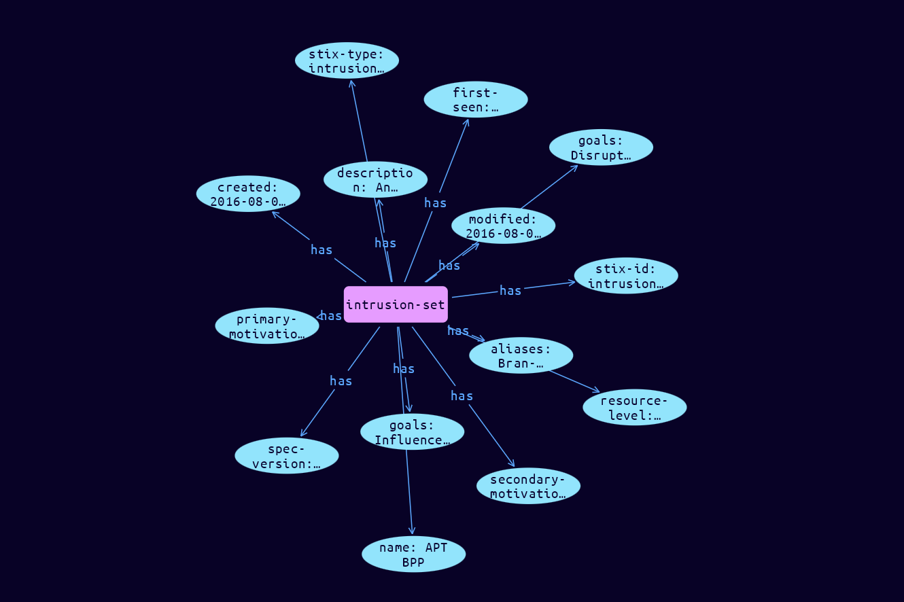

# Intrusion-Set Domain Object

**Stix and TypeQL Object Type:**  `intrusion-set`

An Intrusion Set is a grouped set of adversarial behaviors and resources with common properties that is believed to be orchestrated by a single organization. An Intrusion Set may capture multiple Campaigns or other activities that are all tied together by shared attributes indicating a commonly known or unknown Threat Actor. New activity can be attributed to an Intrusion Set even if the Threat Actors behind the attack are not known. Threat Actors can move from supporting one Intrusion Set to supporting another, or they may support multiple Intrusion Sets.

 

Where a Campaign is a set of attacks over a period of time against a specific set of targets to achieve some objective, an Intrusion Set is the entire attack package and may be used over a very long period of time in multiple Campaigns to achieve potentially multiple purposes.

While sometimes an Intrusion Set is not active, or changes focus, it is usually difficult to know if it has truly disappeared or ended. Analysts may have varying level of fidelity on attributing an Intrusion Set back to Threat Actors and may be able to only attribute it back to a nation state or perhaps back to an organization within that nation state.

[Reference in Stix2.1 Standard](https://docs.oasis-open.org/cti/stix/v2.1/os/stix-v2.1-os.html#_5ol9xlbbnrdn)
## Stix 2.1 Properties Converted to TypeQL
Mapping of the Stix Attack Pattern Properties to TypeDB

|  Stix 2.1 Property    |           Schema Name             | Required  Optional  |      Schema Object Type | Schema Parent  |
|:--------------------|:--------------------------------:|:------------------:|:------------------------:|:-------------:|
|  type                 |            stix-type              |      Required       |  stix-attribute-string    |   attribute    |
|  id                   |             stix-id               |      Required       |  stix-attribute-string    |   attribute    |
|  spec_version         |           spec-version            |      Required       |  stix-attribute-string    |   attribute    |
|  created              |             created               |      Required       | stix-attribute-timestamp  |   attribute    |
|  modified             |             modified              |      Required       | stix-attribute-timestamp  |   attribute    |
|  name                 |               name                |      Optional       |  stix-attribute-string    |   attribute    |
|  description          |           description             |      Optional       |  stix-attribute-string    |   attribute    |
| aliases |aliases |      Optional       |  stix-attribute-string    |   attribute    |
| first_seen |first_seen |      Optional       | stix-attribute-timestamp  |   attribute    |
| last_seen |last-seen |      Optional       | stix-attribute-timestamp  |   attribute    |
| goals |goals |      Optional       |  stix-attribute-string    |   attribute    |
| resource_level |resource-level |      Optional       |  stix-attribute-string    |   attribute    |
| primary_motivation |primary-motivation |      Optional       |  stix-attribute-string    |   attribute    |
| secondary_motivations |secondary-motivations |      Optional       |  stix-attribute-string    |   attribute    |
|  created_by_ref       |        created-by:created         |      Optional       |   embedded     |relation |
|  revoked              |             revoked               |      Optional       |  stix-attribute-boolean   |   attribute    |
|  labels               |              labels               |      Optional       |  stix-attribute-string    |   attribute    |
|  confidence           |            confidence             |      Optional       |  stix-attribute-integer   |   attribute    |
|  lang                 |               lang                |      Optional       |  stix-attribute-string    |   attribute    |
|  external_references  | external-references:referencing   |      Optional       |   embedded     |relation |
|  object_marking_refs  |      object-marking:marked        |      Optional       |   embedded     |relation |
|  granular_markings    |     granular-marking:marked       |      Optional       |   embedded     |relation |
|  extensions           |               n/a                 |        n/a          |           n/a             |      n/a       |

## The Example Intrusion-Set in JSON
The original JSON, accessible in the Python environment
```json
{
    "type": "intrusion-set",
    "spec_version": "2.1",
    "id": "intrusion-set--ed69450a-f067-4b51-9ba2-c4616b9a6713",
    "created": "2016-08-08T15:50:10.983Z",
    "modified": "2016-08-08T15:50:10.983Z",
    "name": "APT BPP",
    "description": "An advanced persistent threat that seeks to disrupt Branistan's election with multiple attacks.",
    "aliases": [
        "Bran-teaser"
    ],
    "first_seen": "2016-01-08T12:50:40.123Z",
    "goals": [
        "Influence the Branistan election",
        "Disrupt the BPP"
    ],
    "resource_level": "government",
    "primary_motivation": "ideology",
    "secondary_motivations": [
        "dominance"
    ]
}
```


## Inserting the Example Intrusion-Set in TypeQL
The TypeQL insert statement
```typeql
 insert $intrusion-set isa intrusion-set,
 has stix-type $stix-type,
 has spec-version $spec-version,
 has stix-id $stix-id,
 has created $created,
 has modified $modified,
 has name $name,
 has description $description,
 has aliases $aliases0,
 has first-seen $first-seen,
 has goals $goals0,
 has goals $goals1,
 has resource-level $resource-level,
 has primary-motivation $primary-motivation,
 has secondary-motivations $secondary_motivations0;

 $stix-type "intrusion-set";
 $spec-version "2.1";
 $stix-id "intrusion-set--ed69450a-f067-4b51-9ba2-c4616b9a6713";
 $created 2016-08-08T15:50:10.983;
 $modified 2016-08-08T15:50:10.983;
 $name "APT BPP";
 $description "An advanced persistent threat that seeks to disrupt Branistan's election with multiple attacks.";
 $aliases0 "Bran-teaser";
 $first-seen 2016-01-08T12:50:40.123;
 $goals0 "Influence the Branistan election";
 $goals1 "Disrupt the BPP";
 $resource-level "government";
 $primary-motivation "ideology";
 $secondary_motivations0 "dominance";
```

## Retrieving the Example Intrusion-Set in TypeQL
The typeQL match statement

```typeql
match
    $a isa intrusion-set,
        has stix-id "intrusion-set--ed69450a-f067-4b51-9ba2-c4616b9a6713",
        has $b;
```


will retrieve the example attack-pattern object in Vaticle Studio


## Retrieving the Example Intrusion-Set  in Python
The Python retrieval statement

```python
from stix.module.typedb_lib import TypeDBSink, TypeDBSource

connection = {
    "uri": "localhost",
    "port": "1729",
    "database": "stix",
    "user": None,
    "password": None
}

import_type = {
    "STIX21": True,
    "CVE": False,
    "identity": False,
    "location": False,
    "rules": False,
    "ATT&CK": False,
    "ATT&CK_Versions": ["12.0"],
    "ATT&CK_Domains": ["enterprise-attack", "mobile-attack", "ics-attack"],
    "CACAO": False
}

typedb = TypeDBSource(connection, import_type)
stix_obj = typedb.get("intrusion-set--ed69450a-f067-4b51-9ba2-c4616b9a6713")
```

