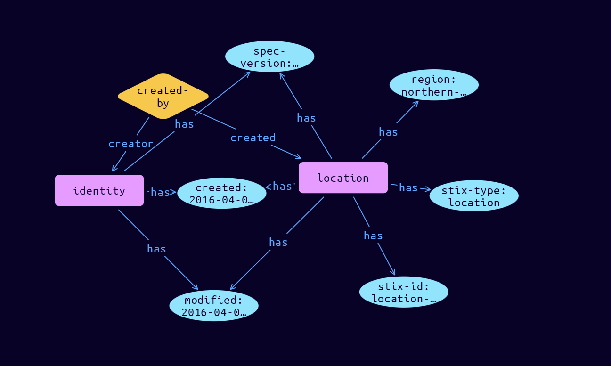

# Location Domain Object

**Stix and TypeQL Object Type:**  `location`

A Location represents a geographic location. The location may be described as any, some or all of the following: region (e.g., North America), civic address (e.g. New York, US), latitude and longitude.

 

Locations are primarily used to give context to other SDOs. For example, a Location could be used in a relationship to describe that the Bourgeois Swallow intrusion set originates from Eastern Europe.

The Location SDO can be related to an Identity or Intrusion Set to indicate that the identity or intrusion set is located in that location. It can also be related from a malware or attack pattern to indicate that they target victims in that location. The Location object describes geographic areas, not governments, even in cases where that area might have a government. For example, a Location representing the United States describes the United States as a geographic area, not the federal government of the United States.

 

At least one of the following properties/sets of properties MUST be provided:

?      region

?      country

?      latitude and longitude

 

When a combination of properties is provided (e.g. a region and a latitude and longitude) the more precise properties are what the location describes. In other words, if a location contains both a region of northern-america and a country of us, then the location describes the United States, not all of North America. In cases where a latitude and longitude are specified without a precision, the location describes the most precise other value.

If precision is specified, then the datum for latitude and longitude MUST be WGS 84 [WGS84]. Organizations specifying a designated location using latitude and longitude SHOULD specify the precision which is appropriate for the scope of the location being identified. The scope is defined by the boundary as outlined by the precision around the coordinates.

[Reference in Stix2.1 Standard](https://docs.oasis-open.org/cti/stix/v2.1/os/stix-v2.1-os.html#_th8nitr8jb4k)
## Stix 2.1 Properties Converted to TypeQL
Mapping of the Stix Attack Pattern Properties to TypeDB

|  Stix 2.1 Property    |           Schema Name             | Required  Optional  |      Schema Object Type | Schema Parent  |
|:--------------------|:--------------------------------:|:------------------:|:------------------------:|:-------------:|
|  type                 |            stix-type              |      Required       |  stix-attribute-string    |   attribute    |
|  id                   |             stix-id               |      Required       |  stix-attribute-string    |   attribute    |
|  spec_version         |           spec-version            |      Required       |  stix-attribute-string    |   attribute    |
|  created              |             created               |      Required       | stix-attribute-timestamp  |   attribute    |
|  modified             |             modified              |      Required       | stix-attribute-timestamp  |   attribute    |
|  name                 |               name                |      Optional       |  stix-attribute-string    |   attribute    |
|  description          |           description             |      Optional       |  stix-attribute-string    |   attribute    |
| latitude |latitude |      Optional       |stix-attribute-double |   attribute    |
| longitude |longitude |      Optional       |stix-attribute-double |   attribute    |
| precision |precision |      Optional       |stix-attribute-double |   attribute    |
| region |region |      Optional       |  stix-attribute-string    |   attribute    |
| country |country |      Optional       |  stix-attribute-string    |   attribute    |
| administrative_area |administrative_area |      Optional       |  stix-attribute-string    |   attribute    |
| city |city |      Optional       |  stix-attribute-string    |   attribute    |
| street_address |street-address |      Optional       |  stix-attribute-string    |   attribute    |
| postal_code |postal-code |      Optional       |  stix-attribute-string    |   attribute    |
| created_by_ref       |        created-by:created         |      Optional       |   embedded     |relation |
|  revoked              |             revoked               |      Optional       |  stix-attribute-boolean   |   attribute    |
|  labels               |              labels               |      Optional       |  stix-attribute-string    |   attribute    |
|  confidence           |            confidence             |      Optional       |  stix-attribute-integer   |   attribute    |
|  lang                 |               lang                |      Optional       |  stix-attribute-string    |   attribute    |
|  external_references  | external-references:referencing   |      Optional       |   embedded     |relation |
|  object_marking_refs  |      object-marking:marked        |      Optional       |   embedded     |relation |
|  granular_markings    |     granular-marking:marked       |      Optional       |   embedded     |relation |
|  extensions           |               n/a                 |        n/a          |           n/a             |      n/a       |

## The Example Location in JSON
The original JSON, accessible in the Python environment
```json
{      
  "type": "location",      
  "spec_version": "2.1",      
  "id": "location--a6e9345f-5a15-4c29-8bb3-7dcc5d168d64",      
  "created_by_ref": "identity--e5f1b90a-d9b6-40ab-81a9-8a29df4b6b65",      
  "created": "2016-04-06T20:03:00.000Z",      
  "modified": "2016-04-06T20:03:00.000Z",      
  "region": "south-eastern-asia",      
  "country": "th",      
  "administrative_area": "Tak",      
  "postal_code": "63170"      
}
```


## Inserting the Example Location in TypeQL
The TypeQL insert statement
```typeql
match  
    $identity0 isa identity, 
        has stix-id "identity--e5f1b90a-d9b6-40ab-81a9-8a29df4b6b65";

insert 
    $location isa location,
        has stix-type $stix-type,
        has spec-version $spec-version,
        has stix-id $stix-id,
        has created $created,
        has modified $modified,
        has region $region,
        has country $country,
        has administrative-area $administrative-area,
        has postal-code $postal-code;
    
    $stix-type "location";
    $spec-version "2.1";
    $stix-id "location--a6e9345f-5a15-4c29-8bb3-7dcc5d168d64";
    $created 2016-04-06T20:03:00.000;
    $modified 2016-04-06T20:03:00.000;
    $region "south-eastern-asia";
    $country "th";
    $administrative-area "Tak";
    $postal-code "63170";
    
    
    $created-by0 (created:$location, creator:$identity0) isa created-by;
```

## Retrieving the Example Location in TypeQL
The typeQL match statement

```typeql
match
    $a isa location,
        has stix-id "location--a6e9345f-5a15-4c29-8bb3-7dcc5d168d64",
        has $b;
    $c (owner:$a, pointed-to:$d) isa embedded;
```


will retrieve the example attack-pattern object in Vaticle Studio


## Retrieving the Example Location  in Python
The Python retrieval statement

```python
from stix.module.typedb_lib import TypeDBSink, TypeDBSource

connection = {
    "uri": "localhost",
    "port": "1729",
    "database": "stix",
    "user": None,
    "password": None
}

import_type = {
    "STIX21": True,
    "CVE": False,
    "identity": False,
    "location": False,
    "rules": False,
    "ATT&CK": False,
    "ATT&CK_Versions": ["12.0"],
    "ATT&CK_Domains": ["enterprise-attack", "mobile-attack", "ics-attack"],
    "CACAO": False
}

typedb = TypeDBSource(connection, import_type)
stix_obj = typedb.get("location--a6e9345f-5a15-4c29-8bb3-7dcc5d168d64")
```

