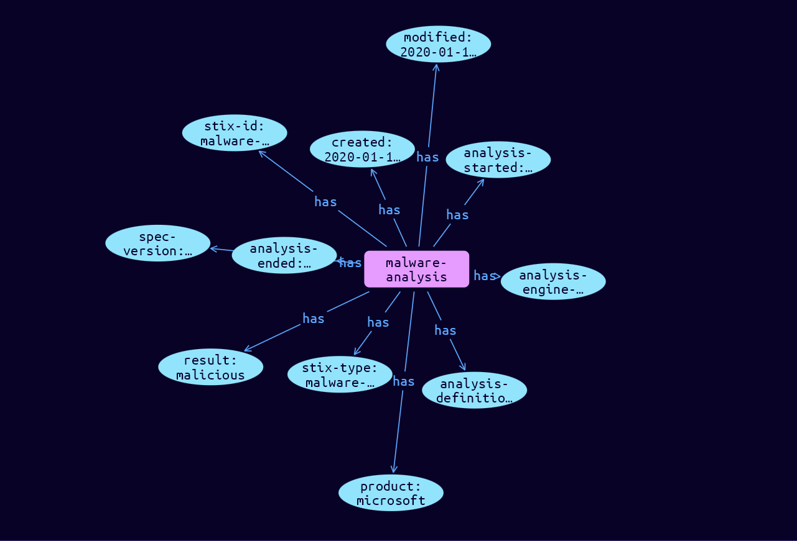

# Malware-Analysis Domain Object

**Stix and TypeQL Object Type:**  `malware-analysis`

Malware Analysis captures the metadata and results of a particular static or dynamic analysis performed on a malware instance or family. One of result or analysis_sco_refs properties MUST be provided.

[Reference in Stix2.1 Standard](https://docs.oasis-open.org/cti/stix/v2.1/os/stix-v2.1-os.html#_6hdrixb3ua4j)
## Stix 2.1 Properties Converted to TypeQL
Mapping of the Stix Attack Pattern Properties to TypeDB

|  Stix 2.1 Property    |           Schema Name             | Required  Optional  |      Schema Object Type | Schema Parent  |
|:--------------------|:--------------------------------:|:------------------:|:------------------------:|:-------------:|
|  type                 |            stix-type              |      Required       |  stix-attribute-string    |   attribute    |
|  id                   |             stix-id               |      Required       |  stix-attribute-string    |   attribute    |
|  spec_version         |           spec-version            |      Required       |  stix-attribute-string    |   attribute    |
|  created              |             created               |      Required       | stix-attribute-timestamp  |   attribute    |
|  modified             |             modified              |      Required       | stix-attribute-timestamp  |   attribute    |
| product |product |      Optional       |  stix-attribute-string    |   attribute    |
| version |version |      Optional       |  stix-attribute-string    |   attribute    |
| host_vm_ref |host-vm-ref:object |      Optional       |   embedded     |relation |
| operating_system_ref |operating-system:object |      Optional       |   embedded     |relation |
| installed_software_refs |installed-software:object |      Optional       |   embedded     |relation |
| configuration_version |configuration-version |      Optional       |  stix-attribute-string    |   attribute    |
| modules |modules |      Optional       |  stix-attribute-string    |   attribute    |
| analysis_engine_version |analysis-engine-version |      Optional       |  stix-attribute-string    |   attribute    |
| analysis_definition_version |analysis-definition-version |      Optional       |  stix-attribute-string    |   attribute    |
| submitted |submitted |      Optional       | stix-attribute-timestamp  |   attribute    |
| analysis_started |analysis-started |      Optional       | stix-attribute-timestamp  |   attribute    |
| analysis_ended |analysis-ended |      Optional       | stix-attribute-timestamp  |   attribute    |
| result_name |result-name |      Optional       |  stix-attribute-string    |   attribute    |
| result |result |      Optional       |  stix-attribute-string    |   attribute    |
| analysis_sco_refs |captured-objects:object |      Optional       |   embedded     |relation |
| sample_ref |malware-analysis-sample:sample-for |      Optional       |   embedded     |relation |
| created_by_ref       |        created-by:created         |      Optional       |   embedded     |relation |
|  revoked              |             revoked               |      Optional       |  stix-attribute-boolean   |   attribute    |
|  labels               |              labels               |      Optional       |  stix-attribute-string    |   attribute    |
|  confidence           |            confidence             |      Optional       |  stix-attribute-integer   |   attribute    |
|  lang                 |               lang                |      Optional       |  stix-attribute-string    |   attribute    |
|  external_references  | external-references:referencing   |      Optional       |   embedded     |relation |
|  object_marking_refs  |      object-marking:marked        |      Optional       |   embedded     |relation |
|  granular_markings    |     granular-marking:marked       |      Optional       |   embedded     |relation |
|  extensions           |               n/a                 |        n/a          |           n/a             |      n/a       |

## The Example Malware-Analysis in JSON
The original JSON, accessible in the Python environment
```json
{    
    "type": "malware-analysis",    
    "spec_version": "2.1",    
    "id": "malware-analysis--d25167b7-fed0-4068-9ccd-a73dd2c5b07c",    
    "created": "2020-01-16T18:52:24.277Z",    
    "modified": "2020-01-16T18:52:24.277Z",    
    "product": "microsoft",    
    "analysis_engine_version": "5.1.0",    
    "analysis_definition_version": "053514-0062",    
    "analysis_started": "2012-02-11T08:36:14Z",    
    "analysis_ended": "2012-02-11T08:36:14Z",    
    "result": "malicious"    
}
```


## Inserting the Example Malware-Analysis in TypeQL
The TypeQL insert statement
```typeql
insert 
    $malware-analysis isa malware-analysis,
        has stix-type $stix-type,
        has spec-version $spec-version,
        has stix-id $stix-id,
        has created $created,
        has modified $modified,
        has product $product,
        has analysis-engine-version $analysis-engine-version,
        has analysis-definition-version $analysis-definition-version,
        has analysis-started $analysis-started,
        has analysis-ended $analysis-ended,
        has result $result;
    
    $stix-type "malware-analysis";
    $spec-version "2.1";
    $stix-id "malware-analysis--d25167b7-fed0-4068-9ccd-a73dd2c5b07c";
    $created 2020-01-16T18:52:24.277;
    $modified 2020-01-16T18:52:24.277;
    $product "microsoft";
    $analysis-engine-version "5.1.0";
    $analysis-definition-version "053514-0062";
    $analysis-started 2012-02-11T08:36:14.000;
    $analysis-ended 2012-02-11T08:36:14.000;
    $result "malicious";
```

## Retrieving the Example Malware-Analysis in TypeQL
The typeQL match statement

```typeql
match
    $a isa malware-analysis,
        has stix-id "malware-analysis--d25167b7-fed0-4068-9ccd-a73dd2c5b07c",
        has $b;
```


will retrieve the example attack-pattern object in Vaticle Studio


## Retrieving the Example Malware-Analysis  in Python
The Python retrieval statement

```python
from stix.module.typedb_lib import TypeDBSink, TypeDBSource

connection = {
    "uri": "localhost",
    "port": "1729",
    "database": "stix",
    "user": None,
    "password": None
}

import_type = {
    "STIX21": True,
    "CVE": False,
    "identity": False,
    "location": False,
    "rules": False,
    "ATT&CK": False,
    "ATT&CK_Versions": ["12.0"],
    "ATT&CK_Domains": ["enterprise-attack", "mobile-attack", "ics-attack"],
    "CACAO": False
}

typedb = TypeDBSource(connection, import_type)
stix_obj = typedb.get("malware-analysis--d25167b7-fed0-4068-9ccd-a73dd2c5b07c")
```

