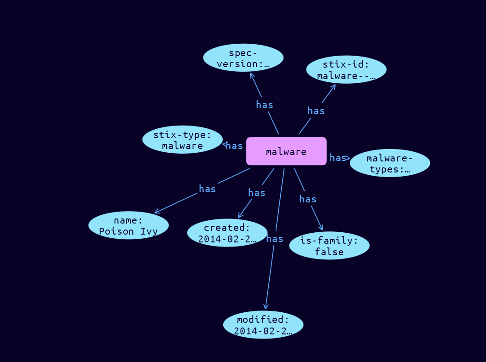

# Malware Domain Object

**Stix and TypeQL Object Type:**  `malware`

Malware is a type of TTP that represents malicious code. It generally refers to a program that is inserted into a system, usually covertly. The intent is to compromise the confidentiality, integrity, or availability of the victim's data, applications, or operating system (OS) or otherwise annoy or disrupt the victim.

 

The Malware SDO characterizes, identifies, and categorizes malware instances and families from data that may be derived from analysis. This SDO captures detailed information about how the malware works and what it does. This SDO captures contextual data relevant to sharing Malware data without requiring the full analysis provided by the Malware Analysis SDO.

 

The Indicator SDO provides intelligence producers with the ability to define, using the STIX Pattern Grammar in a standard way to identify and detect behaviors associated with malicious activities. Although the Malware SDO provides vital intelligence on a specific instance or malware family, it does not provide a standard grammar that the Indicator SDO provides to identify those properties in security detection systems designed to process the STIX Pattern grammar. We strongly encourage the use of STIX Indicators for the detection of actual malware, due to its use of the STIX Patterning language and the clear semantics that it provides.

To minimize the risk of a consumer compromising their system in parsing malware samples, producers SHOULD consider sharing defanged content (archive and password-protected samples) instead of raw, base64-encoded malware samples.

[Reference in Stix2.1 Standard](https://docs.oasis-open.org/cti/stix/v2.1/os/stix-v2.1-os.html#_s5l7katgbp09)
## Stix 2.1 Properties Converted to TypeQL
Mapping of the Stix Attack Pattern Properties to TypeDB

|  Stix 2.1 Property    |           Schema Name             | Required  Optional  |      Schema Object Type | Schema Parent  |
|:--------------------|:--------------------------------:|:------------------:|:------------------------:|:-------------:|
|  type                 |            stix-type              |      Required       |  stix-attribute-string    |   attribute    |
|  id                   |             stix-id               |      Required       |  stix-attribute-string    |   attribute    |
|  spec_version         |           spec-version            |      Required       |  stix-attribute-string    |   attribute    |
|  created              |             created               |      Required       | stix-attribute-timestamp  |   attribute    |
|  modified             |             modified              |      Required       | stix-attribute-timestamp  |   attribute    |
|  name                 |               name                |      Optional       |  stix-attribute-string    |   attribute    |
|  description          |           description             |      Optional       |  stix-attribute-string    |   attribute    |
| malware_types  |malware-types  |      Optional       |  stix-attribute-string    |   attribute    |
| is_family |is-family |      Optional       |  stix-attribute-string    |   attribute    |
| aliases |aliases |      Optional       |  stix-attribute-string    |   attribute    |
| kill_chain_phases |kill-chain-usage:kill-chain-used |      Optional       |   embedded     |relation |
| first_seen |first-seen |      Optional       | stix-attribute-timestamp  |   attribute    |
| last_seen |last-seen |      Optional       | stix-attribute-timestamp  |   attribute    |
| operating_system_refs |operating_system_refs |      Optional       |  stix-attribute-string    |   attribute    |
| architecture_execution_envs |architecture-execution-envs |      Optional       |  stix-attribute-string    |   attribute    |
| implementation_languages |implementation-languages |      Optional       |  stix-attribute-string    |   attribute    |
| capabilities |capabilities |      Optional       |  stix-attribute-string    |   attribute    |
| sample_refs |malware-sample:sample-for |      Optional       |   embedded     |relation |
| created_by_ref       |        created-by:created         |      Optional       |   embedded     |relation |
|  revoked              |             revoked               |      Optional       |  stix-attribute-boolean   |   attribute    |
|  labels               |              labels               |      Optional       |  stix-attribute-string    |   attribute    |
|  confidence           |            confidence             |      Optional       |  stix-attribute-integer   |   attribute    |
|  lang                 |               lang                |      Optional       |  stix-attribute-string    |   attribute    |
|  external_references  | external-references:referencing   |      Optional       |   embedded     |relation |
|  object_marking_refs  |      object-marking:marked        |      Optional       |   embedded     |relation |
|  granular_markings    |     granular-marking:marked       |      Optional       |   embedded     |relation |
|  extensions           |               n/a                 |        n/a          |           n/a             |      n/a       |

## The Example Malware in JSON
The original JSON, accessible in the Python environment
```json
{
    "type": "malware",
    "spec_version": "2.1",
    "id": "malware--fdd60b30-b67c-41e3-b0b9-f01faf20d111",
    "created": "2014-02-20T09:16:08.989Z",
    "modified": "2014-02-20T09:16:08.989Z",
    "name": "Poison Ivy",
    "malware_types": [
        "remote-access-trojan"
    ],
    "is_family": false
}
```


## Inserting the Example Malware in TypeQL
The TypeQL insert statement
```typeql
insert $malware isa malware,
 has stix-type $stix-type,
 has spec-version $spec-version,
 has stix-id $stix-id,
 has created $created,
 has modified $modified,
 has name $name,
 has malware-types $malware_types0,
 has is-family $is-family;

 $stix-type "malware";
 $spec-version "2.1";
 $stix-id "malware--fdd60b30-b67c-41e3-b0b9-f01faf20d111";
 $created 2014-02-20T09:16:08.989;
 $modified 2014-02-20T09:16:08.989;
 $name "Poison Ivy";
 $malware_types0 "remote-access-trojan";
 $is-family false;
```

## Retrieving the Example Malware in TypeQL
The typeQL match statement

```typeql
match
    $a isa malware,
        has stix-id "malware--fdd60b30-b67c-41e3-b0b9-f01faf20d111",
        has $b;
```


will retrieve the example attack-pattern object in Vaticle Studio


## Retrieving the Example Malware  in Python
The Python retrieval statement

```python
from stix.module.typedb_lib import TypeDBSink, TypeDBSource

connection = {
    "uri": "localhost",
    "port": "1729",
    "database": "stix",
    "user": None,
    "password": None
}

import_type = {
    "STIX21": True,
    "CVE": False,
    "identity": False,
    "location": False,
    "rules": False,
    "ATT&CK": False,
    "ATT&CK_Versions": ["12.0"],
    "ATT&CK_Domains": ["enterprise-attack", "mobile-attack", "ics-attack"],
    "CACAO": False
}

typedb = TypeDBSource(connection, import_type)
stix_obj = typedb.get("malware--fdd60b30-b67c-41e3-b0b9-f01faf20d111")
```

