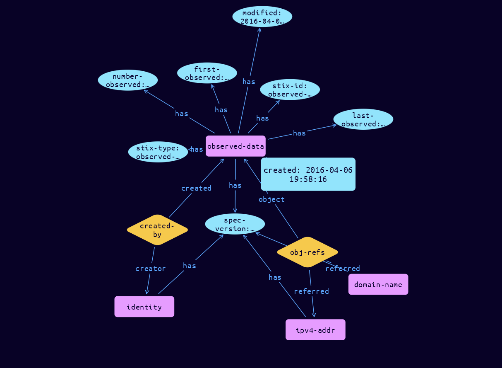

# Observed-Data Domain Object

Observed Data conveys information about cyber security related entities such as files, systems, and networks using the STIX Cyber-observable Objects (SCOs). For example, Observed Data can capture information about an IP address, a network connection, a file, or a registry key. Observed Data is not an intelligence assertion, it is simply the raw information without any context for what it means.

 

Observed Data can capture that a piece of information was seen one or more times. Meaning, it can capture both a single observation of a single entity (file, network connection) as well as the aggregation of multiple observations of an entity. When the number_observed property is 1 the Observed Data represents a single entity. When the number_observed property is greater than 1, the Observed Data represents several instances of an entity potentially collected over a period of time. If a time window is known, that can be captured using the first_observed and last_observed properties. When used to collect aggregate data, it is likely that some properties in the SCO (e.g., timestamp properties) will be omitted because they would differ for each of the individual observations.

 

Observed Data may be used by itself (without relationships) to convey raw data collected from any source including analyst reports, sandboxes, and network and host-based detection tools. An intelligence producer conveying Observed Data SHOULD include as much context (e.g. SCOs) as possible that supports the use of the observed data set in systems expecting to utilize the Observed Data for improved security. This includes all SCOs that matched on an Indicator pattern and are represented in the collected observed event (or events) being conveyed in the Observed Data object. For example, a firewall could emit a single Observed Data instance containing a single Network Traffic object for each connection it sees. The firewall could also aggregate data and instead send out an Observed Data instance every ten minutes with an IP address and an appropriate number_observed value to indicate the number of times that IP address was observed in that window. A sandbox could emit an Observed Data instance containing a file hash that it discovered.

Observed Data may also be related to other SDOs to represent raw data that is relevant to those objects. For example, the Sighting Relationship object, can relate an Indicator, Malware, or other SDO to a specific Observed Data to represent the raw information that led to the creation of the Sighting (e.g., what was actually seen that suggested that a particular instance of malware was active).

 

To support backwards compatibility, related SCOs can still be specified using the objects properties, Either the objects property or the object_refs property MUST be provided, but both MUST NOT be present at the same time.

[Reference in Stix2.1 Standard](https://docs.oasis-open.org/cti/stix/v2.1/os/stix-v2.1-os.html#_p49j1fwoxldc)
## Stix 2.1 Properties Converted to TypeQL
Mapping of the Stix Attack Pattern Properties to TypeDB

|  Stix 2.1 Property    |           Schema Name             | Required  Optional  |      Schema Object Type | Schema Parent  |
|:--------------------|:--------------------------------:|:------------------:|:------------------------:|:-------------:|
|  type                 |            stix-type              |      Required       |  stix-attribute-string    |   attribute    |
|  id                   |             stix-id               |      Required       |  stix-attribute-string    |   attribute    |
|  spec_version         |           spec-version            |      Required       |  stix-attribute-string    |   attribute    |
|  created              |             created               |      Required       | stix-attribute-timestamp  |   attribute    |
|  modified             |             modified              |      Required       | stix-attribute-timestamp  |   attribute    |
| first_observed |first-observed |      Required       | stix-attribute-timestamp  |   attribute    |
| last_observed         |last-observed |      Required       | stix-attribute-timestamp  |   attribute    |
| number_observed  |number-observed |      Required       |  stix-attribute-integer |   attribute    |
| objects |               n/a                 |        n/a          |           n/a             |      n/a       |
| object_refs |obj-refs:object |      Optional       |   embedded     |relation |
| created_by_ref       |        created-by:created         |      Optional       |   embedded     |relation |
|  revoked              |             revoked               |      Optional       |  stix-attribute-boolean   |   attribute    |
|  labels               |              labels               |      Optional       |  stix-attribute-string    |   attribute    |
|  confidence           |            confidence             |      Optional       |  stix-attribute-integer   |   attribute    |
|  lang                 |               lang                |      Optional       |  stix-attribute-string    |   attribute    |
|  external_references  | external-references:referencing   |      Optional       |   embedded     |relation |
|  object_marking_refs  |      object-marking:marked        |      Optional       |   embedded     |relation |
|  granular_markings    |     granular-marking:marked       |      Optional       |   embedded     |relation |
|  extensions           |               n/a                 |        n/a          |           n/a             |      n/a       |

## The Example Observed-Data in JSON
The original JSON, accessible in the Python environment
```json
{
  "type": "observed-data",  
  "spec_version": "2.1",  
  "id": "observed-data--b67d30ff-02ac-498a-92f9-32f845f448cf",  
  "created_by_ref": "identity--e5f1b90a-d9b6-40ab-81a9-8a29df4b6b65",  
  "created": "2016-04-06T19:58:16.000Z",  
  "modified": "2016-04-06T19:58:16.000Z",  
  "first_observed": "2015-12-21T19:00:00Z",  
  "last_observed": "2015-12-21T19:00:00Z",  
  "number_observed": 50,  
  "object_refs": [  
    "ipv4-addr--efcd5e80-570d-4131-b213-62cb18eaa6a8",  
    "domain-name--ecb120bf-2694-4902-a737-62b74539a41b"  
  ]  
}
```


## Inserting the Example Observed-Data in TypeQL
The TypeQL insert statement
```typeql
match  
    $identity0 isa identity, has stix-id "identity--e5f1b90a-d9b6-40ab-81a9-8a29df4b6b65";
    $ipv4-addr01 isa ipv4-addr, has stix-id "ipv4-addr--efcd5e80-570d-4131-b213-62cb18eaa6a8";
    $domain-name11 isa domain-name, has stix-id "domain-name--ecb120bf-2694-4902-a737-62b74539a41b";
insert 
    $observed-data isa observed-data,
        has stix-type $stix-type,
        has spec-version $spec-version,
        has stix-id $stix-id,
        has created $created,
        has modified $modified,
        has first-observed $first-observed,
        has last-observed $last-observed,
        has number-observed $number-observed;
    
    $stix-type "observed-data";
    $spec-version "2.1";
    $stix-id "observed-data--b67d30ff-02ac-498a-92f9-32f845f448cf";
    $created 2016-04-06T19:58:16.000;
    $modified 2016-04-06T19:58:16.000;
    $first-observed 2015-12-21T19:00:00.000;
    $last-observed 2015-12-21T19:00:00.000;
    $number-observed 50;
    
    $created-by0 (created:$observed-data, creator:$identity0) isa created-by;
    
    $obj-refs1 (object:$observed-data, referred:$ipv4-addr01, referred:$domain-name11) isa obj-refs;
```

## Retrieving the Example Observed-Data in TypeQL
The typeQL match statement

```typeql
match
    $a isa observed-data,
        has stix-id "observed-data--b67d30ff-02ac-498a-92f9-32f845f448cf",
        has $b;
    $c (owner:$a, pointed-to:$d) isa embedded;
```


will retrieve the example attack-pattern object in Vaticle Studio


## Retrieving the Example Observed-Data  in Python
The Python retrieval statement

```python
from stix.module.typedb import TypeDBSink, TypeDBSource
connection = {
    "uri": "localhost",
    "port": "1729",
    "database": "stix",
    "user": None,
    "password": None
}

import_type = {
    "STIX21": True,
    "CVE": False,
    "identity": False,
    "location": False,
    "rules": False,
    "ATT&CK": False,
    "ATT&CK_Versions": ["12.0"],
    "ATT&CK_Domains": ["enterprise-attack", "mobile-attack", "ics-attack"],
    "CACAO": False
}

typedb = TypeDBSource(connection, import_type)
stix_obj = typedb.get("observed-data--b67d30ff-02ac-498a-92f9-32f845f448cf")
```

