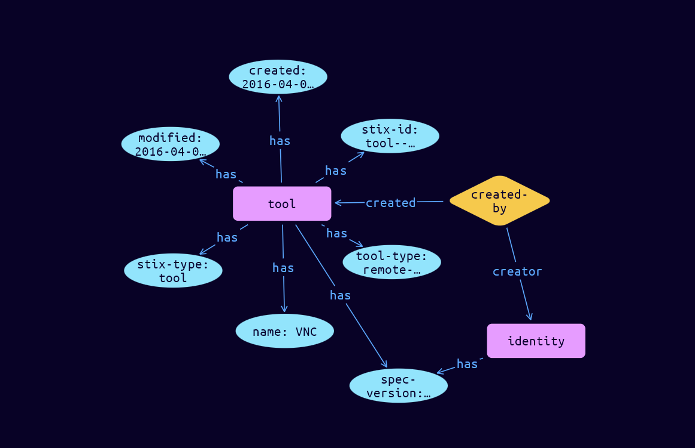

# Tool Domain Object

**Stix and TypeQL Object Type:**  `tool`

Tools are legitimate software that can be used by threat actors to perform attacks. Knowing how and when threat actors use such tools can be important for understanding how campaigns are executed. Unlike malware, these tools or software packages are often found on a system and have legitimate purposes for power users, system administrators, network administrators, or even normal users. Remote access tools (e.g., RDP) and network scanning tools (e.g., Nmap) are examples of Tools that may be used by a Threat Actor during an attack.

 

The Tool SDO characterizes the properties of these software tools and can be used as a basis for making an assertion about how a Threat Actor uses them during an attack. It contains properties to name and describe the tool, a list of Kill Chain Phases the tool can be used to carry out, and the version of the tool.

This SDO MUST NOT be used to characterize malware. Further, Tool MUST NOT be used to characterize tools used as part of a course of action in response to an attack.

[Reference in Stix2.1 Standard](https://docs.oasis-open.org/cti/stix/v2.1/os/stix-v2.1-os.html#_z4voa9ndw8v)
## Stix 2.1 Properties Converted to TypeQL
Mapping of the Stix Attack Pattern Properties to TypeDB

|  Stix 2.1 Property    |           Schema Name             | Required  Optional  |      Schema Object Type | Schema Parent  |
|:--------------------|:--------------------------------:|:------------------:|:------------------------:|:-------------:|
|  type                 |            stix-type              |      Required       |  stix-attribute-string    |   attribute    |
|  id                   |             stix-id               |      Required       |  stix-attribute-string    |   attribute    |
|  spec_version         |           spec-version            |      Required       |  stix-attribute-string    |   attribute    |
|  created              |             created               |      Required       | stix-attribute-timestamp  |   attribute    |
|  modified             |             modified              |      Required       | stix-attribute-timestamp  |   attribute    |
|  name                 |               name                |      Required       |  stix-attribute-string    |   attribute    |
|  description          |           description             |      Optional       |  stix-attribute-string    |   attribute    |
| tool_types |tool-type |      Optional       |  stix-attribute-string    |   attribute    |
| aliases |aliases |      Optional       |  stix-attribute-string    |   attribute    |
| kill_chain_phases |kill-chain-usage:kill-chain-using |      Optional       |   embedded     |relation |
| tool_version |tool-version |      Optional       |  stix-attribute-string    |   attribute    |
|  created_by_ref       |        created-by:created         |      Optional       |   embedded     |relation |
|  revoked              |             revoked               |      Optional       |  stix-attribute-boolean   |   attribute    |
|  labels               |              labels               |      Optional       |  stix-attribute-string    |   attribute    |
|  confidence           |            confidence             |      Optional       |  stix-attribute-integer   |   attribute    |
|  lang                 |               lang                |      Optional       |  stix-attribute-string    |   attribute    |
|  external_references  | external-references:referencing   |      Optional       |   embedded     |relation |
|  object_marking_refs  |      object-marking:marked        |      Optional       |   embedded     |relation |
|  granular_markings    |     granular-marking:marked       |      Optional       |   embedded     |relation |
|  extensions           |               n/a                 |        n/a          |           n/a             |      n/a       |

## The Example Tool in JSON
The original JSON, accessible in the Python environment
```json
{
    "type": "tool",  
    "spec_version": "2.1",  
    "id": "tool--8e2e2d2b-17d4-4cbf-938f-98ee46b3cd3f",  
    "created_by_ref": "identity--f431f809-377b-45e0-aa1c-6a4751cae5ff",  
    "created": "2016-04-06T20:03:48.000Z",  
    "modified": "2016-04-06T20:03:48.000Z",  
    "tool_types": [ "remote-access"],  
    "name": "VNC"  
  }
```


## Inserting the Example Tool in TypeQL
The TypeQL insert statement
```typeql
match  
    $identity0 isa identity, 
        has stix-id "identity--f431f809-377b-45e0-aa1c-6a4751cae5ff";
        
insert 
    $tool isa tool,
        has stix-type $stix-type,
        has spec-version $spec-version,
        has stix-id $stix-id,
        has created $created,
        has modified $modified,
        has name $name,
        has tool-type $tool_types0;
    
    $stix-type "tool";
    $spec-version "2.1";
    $stix-id "tool--8e2e2d2b-17d4-4cbf-938f-98ee46b3cd3f";
    $created 2016-04-06T20:03:48.000;
    $modified 2016-04-06T20:03:48.000;
    $name "VNC";
    $tool_types0 "remote-access";
    
    $created-by0 (created:$tool, creator:$identity0) isa created-by;
```

## Retrieving the Example Tool in TypeQL
The typeQL match statement

```typeql
match
    $a isa tool,
        has stix-id "tool--8e2e2d2b-17d4-4cbf-938f-98ee46b3cd3f",
        has $b;
    $c (owner:$a, pointed-to:$d) isa embedded;
```


will retrieve the example attack-pattern object in Vaticle Studio


## Retrieving the Example Tool  in Python
The Python retrieval statement

```python
from stix.module.typedb_lib import TypeDBSink, TypeDBSource

connection = {
    "uri": "localhost",
    "port": "1729",
    "database": "stix",
    "user": None,
    "password": None
}

import_type = {
    "STIX21": True,
    "CVE": False,
    "identity": False,
    "location": False,
    "rules": False,
    "ATT&CK": False,
    "ATT&CK_Versions": ["12.0"],
    "ATT&CK_Domains": ["enterprise-attack", "mobile-attack", "ics-attack"],
    "CACAO": False
}

typedb = TypeDBSource(connection, import_type)
stix_obj = typedb.get("tool--8e2e2d2b-17d4-4cbf-938f-98ee46b3cd3f")
```

