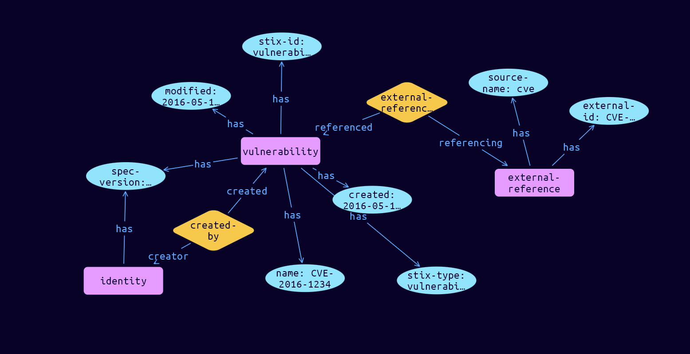

# Vulnerability Domain Object

**Stix and TypeQL Object Type:**  `vulnerability`

A Vulnerability is a weakness or defect in the requirements, designs, or implementations of the computational logic (e.g., code) found in software and some hardware components (e.g., firmware) that can be directly exploited to negatively impact the confidentiality, integrity, or availability of that system.

 

CVE is a list of information security vulnerabilities and exposures that provides common names for publicly known problems [CVE]. For example, if a piece of malware exploits CVE-2015-12345, a Malware object could be linked to a Vulnerability object that references CVE-2015-12345.

The Vulnerability SDO is primarily used to link to external definitions of vulnerabilities or to describe 0-day vulnerabilities that do not yet have an external definition. Typically, other SDOs assert relationships to Vulnerability objects when a specific vulnerability is targeted and exploited as part of malicious cyber activity. As such, Vulnerability objects can be used as a linkage to the asset management and compliance process.

[Reference in Stix2.1 Standard](https://docs.oasis-open.org/cti/stix/v2.1/os/stix-v2.1-os.html#_q5ytzmajn6re)
## Stix 2.1 Properties Converted to TypeQL
Mapping of the Stix Attack Pattern Properties to TypeDB

|  Stix 2.1 Property    |           Schema Name             | Required  Optional  |      Schema Object Type | Schema Parent  |
|:--------------------|:--------------------------------:|:------------------:|:------------------------:|:-------------:|
|  type                 |            stix-type              |      Required       |  stix-attribute-string    |   attribute    |
|  id                   |             stix-id               |      Required       |  stix-attribute-string    |   attribute    |
|  spec_version         |           spec-version            |      Required       |  stix-attribute-string    |   attribute    |
|  created              |             created               |      Required       | stix-attribute-timestamp  |   attribute    |
|  modified             |             modified              |      Required       | stix-attribute-timestamp  |   attribute    |
|  name                 |               name                |      Required       |  stix-attribute-string    |   attribute    |
|  description          |           description             |      Optional       |  stix-attribute-string    |   attribute    |
|  created_by_ref       |        created-by:created         |      Optional       |   embedded     |relation |
|  revoked              |             revoked               |      Optional       |  stix-attribute-boolean   |   attribute    |
|  labels               |              labels               |      Optional       |  stix-attribute-string    |   attribute    |
|  confidence           |            confidence             |      Optional       |  stix-attribute-integer   |   attribute    |
|  lang                 |               lang                |      Optional       |  stix-attribute-string    |   attribute    |
|  external_references  | external-references:referencing   |      Optional       |   embedded     |relation |
|  object_marking_refs  |      object-marking:marked        |      Optional       |   embedded     |relation |
|  granular_markings    |     granular-marking:marked       |      Optional       |   embedded     |relation |
|  extensions           |               n/a                 |        n/a          |           n/a             |      n/a       |

## The Example Vulnerability in JSON
The original JSON, accessible in the Python environment
```json
{
    "type": "vulnerability",  
    "spec_version": "2.1",  
    "id": "vulnerability--0c7b5b88-8ff7-4a4d-aa9d-feb398cd0061",  
    "created": "2016-05-12T08:17:27.000Z",  
    "modified": "2016-05-12T08:17:27.000Z",  
    "created_by_ref": "identity--f431f809-377b-45e0-aa1c-6a4751cae5ff",  
    "name": "CVE-2016-1234",  
    "external_references": [  
      {  
        "source_name": "cve",  
        "external_id": "CVE-2016-1234"  
      }  
    ]  
  }
```


## Inserting the Example Vulnerability in TypeQL
The TypeQL insert statement
```typeql
match  
    $identity0 isa identity, 
        has stix-id "identity--f431f809-377b-45e0-aa1c-6a4751cae5ff";
insert 
    $vulnerability isa vulnerability,
        has stix-type $stix-type,
        has spec-version $spec-version,
        has stix-id $stix-id,
        has created $created,
        has modified $modified,
        has name $name;
    
    $stix-type "vulnerability";
    $spec-version "2.1";
    $stix-id "vulnerability--0c7b5b88-8ff7-4a4d-aa9d-feb398cd0061";
    $created 2016-05-12T08:17:27.000;
    $modified 2016-05-12T08:17:27.000;
    $name "CVE-2016-1234";
    
    $created-by0 (created:$vulnerability, creator:$identity0) isa created-by;
    $external-reference0 isa external-reference,
        has source-name "cve",
        has external-id "CVE-2016-1234";
    
    $external-references (referenced:$vulnerability, referencing:$external-reference0) isa external-references;
```

## Retrieving the Example Vulnerability in TypeQL
The typeQL match statement

```typeql
match
    $a isa vulnerability,
        has stix-id "vulnerability--0c7b5b88-8ff7-4a4d-aa9d-feb398cd0061",
        has $b;
    $c isa stix-sub-object,
        has $d;
    $e (owner:$a, pointed-to:$c) isa embedded;
    $f (owner:$a, pointed-to:$g) isa embedded;
```


will retrieve the example attack-pattern object in Vaticle Studio


## Retrieving the Example Vulnerability  in Python
The Python retrieval statement

```python
from stix.module.typedb_lib import TypeDBSink, TypeDBSource

connection = {
    "uri": "localhost",
    "port": "1729",
    "database": "stix",
    "user": None,
    "password": None
}

import_type = {
    "STIX21": True,
    "CVE": False,
    "identity": False,
    "location": False,
    "rules": False,
    "ATT&CK": False,
    "ATT&CK_Versions": ["12.0"],
    "ATT&CK_Domains": ["enterprise-attack", "mobile-attack", "ics-attack"],
    "CACAO": False
}

typedb = TypeDBSource(connection, import_type)
stix_obj = typedb.get("vulnerability--0c7b5b88-8ff7-4a4d-aa9d-feb398cd0061")
```

