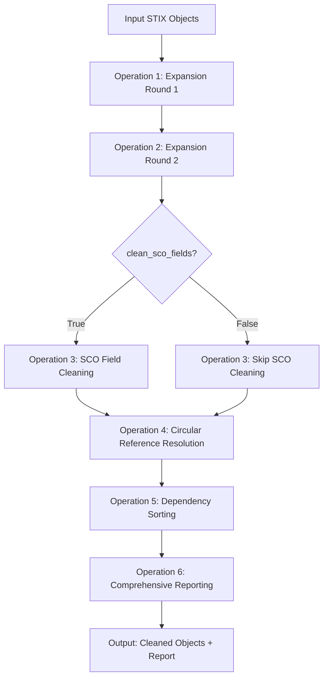

# STIX Bundle and List Cleaning Module

A comprehensive Python module for cleaning and processing STIX object collections with expansion, SCO field cleaning, circular reference resolution, dependency sorting, and detailed reporting capabilities.

## Table of Contents

- [Overview](#overview)
- [Installation](#installation)
- [Quick Start](#quick-start)
- [Function Reference](#function-reference)
- [Operations Pipeline](#operations-pipeline)
- [Pydantic Models](#pydantic-models)
- [Usage Examples](#usage-examples)
- [Error Handling](#error-handling)
- [Performance Considerations](#performance-considerations)
- [Integration Guide](#integration-guide)

## Overview

The `clean_list_or_bundle` module provides two main functions that apply a 6-step cleaning pipeline to STIX object collections:

### Core Functions

1. **`clean_stix_list()`** - Process STIX objects directly from memory
2. **`clean_stix_directory()`** - Process STIX files from filesystem with automatic organization

### Six-Step Processing Pipeline



## Installation

The module is part of the STIX-ORM framework and requires the following dependencies:

```python
# Core dependencies
from pydantic import BaseModel, ConfigDict
from typing import List, Dict, Union, Optional, Tuple
from typing_extensions import Literal

# Integration with existing STIX-ORM
from stixorm.module.parsing.content.parse import get_group_from_type
```

## Quick Start

### Basic Usage - Clean Object List

```python
from stixorm.module.parsing.clean_list_or_bundle import clean_stix_list, StixObject

# Sample STIX objects
stix_objects = [
    StixObject(id="malware--123", type="malware"),
    StixObject(id="attack-pattern--456", type="attack-pattern")
]

# Clean objects (SCO cleaning disabled by default)
cleaned_objects, report = clean_stix_list(stix_objects)

print(f"Processed {len(cleaned_objects)} objects")
print(f"Success: {report.clean_operation_outcome}")
```

### Basic Usage - Clean Directory

```python
from stixorm.module.parsing.clean_list_or_bundle import clean_stix_directory

# Process all JSON files in directory
reports = clean_stix_directory("/path/to/stix/files")

for report in reports:
    print(f"File processing: {report.clean_operation_outcome}")
```

### Enable SCO Field Cleaning

```python
# Enable SCO field cleaning (removes 'created', 'modified' from SCOs)
cleaned_objects, report = clean_stix_list(stix_objects, clean_sco_fields=True)

# Check SCO cleaning results
sco_report = report.detailed_operation_reports.cleaning_sco_report
print(f"SCOs cleaned: {sco_report.number_of_scos_cleaned}")
```

## Function Reference

### clean_stix_list()

```python
def clean_stix_list(
    stix_list: List[StixObject], 
    clean_sco_fields: bool = False
) -> Tuple[List[StixObject], Union[CleanStixListSuccessReport, CleanStixListFailureReport]]
```

**Parameters:**
- `stix_list` (List[StixObject]): Raw STIX objects requiring cleaning
- `clean_sco_fields` (bool, optional): Whether to run SCO Field Cleaning operation (default: False)

**Returns:**
- Tuple containing:
  - `List[StixObject]`: Processed and sorted STIX objects
  - Report: Success/failure report with detailed operation metrics

**Example:**
```python
objects = [StixObject(id="malware--123", type="malware")]
cleaned, report = clean_stix_list(objects, clean_sco_fields=True)
```

### clean_stix_directory()

```python
def clean_stix_directory(
    directory_path: str, 
    clean_sco_fields: bool = False
) -> List[Union[CleanStixListSuccessReport, CleanStixListFailureReport]]
```

**Parameters:**
- `directory_path` (str): Target directory containing STIX JSON files
- `clean_sco_fields` (bool, optional): Whether to run SCO Field Cleaning operation (default: False)

**Returns:**
- `List[Report]`: Collection of processing reports (one per input file)

**File Organization:**
```
input_directory/
├── original/           # Moved original files
├── reports/           # Detailed JSON reports
├── file1.json         # Cleaned STIX bundles
└── file2.json
```

**Example:**
```python
reports = clean_stix_directory("/data/stix", clean_sco_fields=True)
print(f"Processed {len(reports)} files")
```

## Operations Pipeline

### Operation 1: Object Expansion (Round 1)

**Purpose**: Fetch missing referenced objects from external STIX repositories.

**External Sources** (checked sequentially):
1. MITRE ATT&CK Enterprise
2. MITRE ATT&CK Mobile  
3. MITRE ATT&CK ICS
4. MITRE Atlas
5. Malware MBC

**Process:**
1. Extract all STIX ID references from existing objects
2. Compare with defined object IDs
3. Fetch missing objects from external sources
4. Add found objects to collection

### Operation 2: Object Expansion (Round 2)

**Purpose**: Handle transitive dependencies introduced by newly added objects.

**Process:**
- Re-run expansion logic on the expanded dataset
- Catch references introduced by objects added in Round 1
- Ensure complete object graph coverage

### Operation 3: SCO Field Cleaning (Conditional)

**Purpose**: Remove forbidden fields from STIX Cyber Observable objects.

**Execution**: Only runs when `clean_sco_fields=True`

**SCO Detection:**
```python
from stixorm.module.parsing.content.parse import get_group_from_type
is_sco = get_group_from_type(stix_type) == "sco"
```

**Fields Removed:**
- `created` (forbidden in STIX spec for SCOs)
- `modified` (forbidden in STIX spec for SCOs)
- Other non-specification fields

### Operation 4: Circular Reference Resolution

**Purpose**: Break circular dependency chains to enable topological sorting.

**Detection Patterns:**
1. **Self-Reference**: Object references its own ID
2. **Bidirectional**: A→B and B→A relationships

**Resolution Strategy:**
```python
# Self-reference: Remove referencing field
if obj.created_by_ref == obj.id:
    del obj.created_by_ref

# Identity ↔ Marking Definition: Remove object_marking_refs from Identity  
if identity.object_marking_refs.contains(marking_def.id) and 
   marking_def.created_by_ref == identity.id:
    identity.object_marking_refs.remove(marking_def.id)
```

### Operation 5: Dependency Sorting

**Purpose**: Topologically sort objects so referenced objects appear before referencing objects.

**Algorithm**: Kahn's algorithm for cycle-safe topological sorting

**Process:**
1. Build dependency graph from object references
2. Calculate in-degrees for all nodes
3. Process nodes with zero in-degree first
4. Propagate dependency satisfaction

**Fallback**: If sorting fails, retry expansion operations

### Operation 6: Comprehensive Reporting

**Purpose**: Aggregate all operation results into detailed success/failure reports.

**Components:**
- Individual operation reports
- Overall success/failure status
- Processing timestamps
- File organization details (directory processing only)

## Pydantic Models

### Core STIX Models

```python
class StixObject(BaseModel):
    model_config = ConfigDict(extra='allow')
    id: str
    type: str

class StixBundle(BaseModel):
    type: str = "bundle"
    id: str
    objects: List[StixObject]
```

### Report Models

#### DeduplicationReport
```python
class DeduplicationReport(BaseModel):
    number_of_objects_before_deduplication: int
    number_of_objects_after_deduplication: int
    number_of_duplicates_removed: int
    list_of_duplicate_stix_ids: List[str]
```

#### ExpansionReport
```python
class ExpansionReport(BaseModel):
    number_of_objects_defined: int
    number_of_objects_referenced: int
    missing_ids_list: List[str]
    sources_of_expansion: List[Dict[str, List[str]]]
```

#### CleaningSCOReport
```python
class CleaningSCOReport(BaseModel):
    number_of_scos_cleaned: int
    list_of_stix_ids_where_created_field_was_removed: List[str]
    list_of_stix_ids_where_modified_field_was_removed: List[str]
    list_of_stix_ids_where_other_fields_were_removed: List[Dict[str, List[str]]]
```

#### CircularReferenceReport
```python
class CircularReferenceReport(BaseModel):
    number_of_circular_references_found: int
    list_of_circular_reference_paths: List[List[str]]
    deleted_fields_and_values: List[Dict[str, List[DeletedFieldAndValue]]]
```

#### SortingReport
```python
class SortingReport(BaseModel):
    sorting_successful: bool
    sorted_list_of_stix_ids: List[str]
    diagram_of_sorted_dependencies: str
    unresolved_references: List[str]
```

#### Success/Failure Reports
```python
class CleanStixListSuccessReport(BaseModel):
    report_date_time: str  # "%Y-%m-%d %H:%M:%S"
    total_number_of_objects_processed: int
    clean_operation_outcome: Literal[True]
    return_message: str
    detailed_operation_reports: OperationsReport

class CleanStixListFailureReport(BaseModel):
    report_date_time: str
    total_number_of_objects_processed: int
    clean_operation_outcome: Literal[False]
    return_message: str
    detailed_operation_reports: OperationsReport
```

## Usage Examples

### Example 1: Basic Object Cleaning

```python
from stixorm.module.parsing.clean_list_or_bundle import clean_stix_list, StixObject

# Create test objects with references
objects = [
    StixObject(id="malware--123", type="malware", **{
        "created_by_ref": "identity--456"
    }),
    StixObject(id="attack-pattern--789", type="attack-pattern")
]

# Clean without SCO processing
cleaned_objects, report = clean_stix_list(objects)

# Check expansion results
expansion = report.detailed_operation_reports.expansion_report
print(f"Objects defined: {expansion.number_of_objects_defined}")
print(f"Missing IDs: {expansion.missing_ids_list}")

# Check sorting results  
sorting = report.detailed_operation_reports.sorting_report
print(f"Sorting successful: {sorting.sorting_successful}")
print(f"Dependency diagram:\n{sorting.diagram_of_sorted_dependencies}")
```

### Example 2: SCO Field Cleaning

```python
# Create SCO objects with forbidden fields
sco_objects = [
    StixObject(id="file--123", type="file", **{
        "hashes": {"MD5": "abc123"},
        "created": "2023-01-01T00:00:00Z",  # This will be removed
        "modified": "2023-01-02T00:00:00Z"  # This will be removed
    })
]

# Enable SCO cleaning
cleaned_scos, report = clean_stix_list(sco_objects, clean_sco_fields=True)

# Check SCO cleaning results
sco_report = report.detailed_operation_reports.cleaning_sco_report
print(f"SCOs cleaned: {sco_report.number_of_scos_cleaned}")
print(f"Created fields removed from: {sco_report.list_of_stix_ids_where_created_field_was_removed}")
print(f"Modified fields removed from: {sco_report.list_of_stix_ids_where_modified_field_was_removed}")
```

### Example 3: Directory Processing

```python
import json
from pathlib import Path

# Setup test directory
test_dir = Path("./test_stix_data")
test_dir.mkdir(exist_ok=True)

# Create sample STIX files
bundle1 = {
    "type": "bundle",
    "id": "bundle--123",
    "objects": [
        {"id": "malware--456", "type": "malware", "name": "Test Malware"}
    ]
}

with open(test_dir / "malware_bundle.json", "w") as f:
    json.dump(bundle1, f, indent=2)

# Process directory
reports = clean_stix_directory(str(test_dir), clean_sco_fields=True)

# Check results
for report in reports:
    if report.clean_operation_outcome:
        print(f"✓ Successfully processed {report.total_number_of_objects_processed} objects")
        
        # Check file operations
        file_report = report.detailed_operation_reports.file_report
        if file_report:
            for file_info in file_report.list_of_processed_changes_per_file:
                print(f"  Original: {file_info.original_file_path}")
                print(f"  Cleaned: {file_info.updated_file_path}")
                print(f"  Report: {file_info.report_file_path}")
    else:
        print(f"✗ Processing failed: {report.return_message}")
```

### Example 4: Handling Circular References

```python
# Create objects with circular references
circular_objects = [
    StixObject(id="identity--123", type="identity", **{
        "created_by_ref": "identity--123",  # Self-reference
        "object_marking_refs": ["marking-definition--456"]
    }),
    StixObject(id="marking-definition--456", type="marking-definition", **{
        "created_by_ref": "identity--123"  # Creates circular reference
    })
]

# Process objects
cleaned, report = clean_stix_list(circular_objects)

# Check circular reference resolution
circular = report.detailed_operation_reports.circular_reference_report
print(f"Circular references found: {circular.number_of_circular_references_found}")
print(f"Circular paths: {circular.list_of_circular_reference_paths}")

for deletion in circular.deleted_fields_and_values:
    stix_id = deletion["stix_id"]
    fields = deletion["deleted_fields"]
    print(f"Object {stix_id}: removed {len(fields)} fields")
```

## Error Handling

### Network Resilience

The module handles external source failures gracefully:

```python
# Example with network issues
objects = [StixObject(id="malware--123", type="malware")]
cleaned, report = clean_stix_list(objects)

# Check expansion warnings
expansion = report.detailed_operation_reports.expansion_report
if expansion.missing_ids_list:
    print(f"Warning: Could not resolve {len(expansion.missing_ids_list)} references")
    print(f"Missing IDs: {expansion.missing_ids_list}")
```

### Data Integrity Protection

Original data is never modified:

```python
import copy

original_objects = [StixObject(id="test--123", type="malware")]
original_copy = copy.deepcopy(original_objects)

cleaned, report = clean_stix_list(original_objects)

# Original objects unchanged
assert original_objects == original_copy
```

### File Operation Safety

Directory processing uses atomic operations:

```python
# If processing fails, original files are preserved
try:
    reports = clean_stix_directory("/path/to/data")
except Exception as e:
    print(f"Processing failed: {e}")
    # Original files remain in place
```

## Performance Considerations

### Memory Management

For large datasets, consider processing in batches:

```python
def process_large_dataset(objects, batch_size=1000):
    results = []
    for i in range(0, len(objects), batch_size):
        batch = objects[i:i + batch_size]
        cleaned, report = clean_stix_list(batch)
        results.extend(cleaned)
    return results
```

### Network Optimization

External source data is cached during processing:

```python
# Multiple calls within same session reuse cached data
for file_batch in file_batches:
    clean_stix_directory(file_batch)  # Cached external data reused
```

### Processing Efficiency

- Use `clean_sco_fields=False` (default) if SCO cleaning not needed
- Directory processing is optimized for multiple files
- Topological sorting uses efficient Kahn's algorithm

## Integration Guide

### Integration with STIX-ORM

```python
from stixorm.module.parsing.clean_list_or_bundle import clean_stix_list
from stixorm.module.parsing import parse_stix_data

# Parse and then clean
parsed_objects = parse_stix_data(raw_data)
cleaned_objects, report = clean_stix_list(parsed_objects)
```

### Custom SCO Detection

Override SCO detection for custom types:

```python
# Custom SCO type detection
def custom_get_group_from_type(stix_type: str) -> str:
    custom_scos = {"x-custom-observable"}
    if stix_type in custom_scos:
        return "sco"
    return get_group_from_type(stix_type)

# Monkey patch for custom behavior
import stixorm.module.parsing.clean_list_or_bundle
stixorm.module.parsing.clean_list_or_bundle.get_group_from_type = custom_get_group_from_type
```

### Workflow Integration

```python
def complete_stix_workflow(input_path: str, output_path: str):
    """Complete STIX processing workflow"""
    
    # 1. Clean and organize
    reports = clean_stix_directory(input_path, clean_sco_fields=True)
    
    # 2. Validate results
    successful_reports = [r for r in reports if r.clean_operation_outcome]
    
    # 3. Generate summary
    total_objects = sum(r.total_number_of_objects_processed for r in successful_reports)
    
    # 4. Export results
    summary = {
        "files_processed": len(successful_reports),
        "total_objects": total_objects,
        "timestamp": datetime.now().isoformat()
    }
    
    return summary
```

## Troubleshooting

### Common Issues

1. **Import Errors**:
   ```python
   # If get_group_from_type import fails, fallback is used automatically
   # Check STIX-ORM installation
   ```

2. **Network Timeouts**:
   ```python
   # Adjust timeout in _fetch_external_data function if needed
   # Default: 30 seconds per source
   ```

3. **File Permission Errors**:
   ```python
   # Ensure write permissions for target directory
   # Check disk space before processing large datasets
   ```

4. **Memory Issues**:
   ```python
   # Process large directories in smaller batches
   # Monitor memory usage during expansion operations
   ```

### Debug Mode

Enable detailed logging for troubleshooting:

```python
import logging
logging.basicConfig(level=logging.DEBUG)

# Now clean_stix_list and clean_stix_directory will show detailed logs
cleaned, report = clean_stix_list(objects)
```

---

**Module**: `stixorm.module.parsing.clean_list_or_bundle`  
**Version**: 1.0.0  
**License**: Compatible with STIX-ORM licensing  
**Dependencies**: Pydantic v2, Python 3.8+
